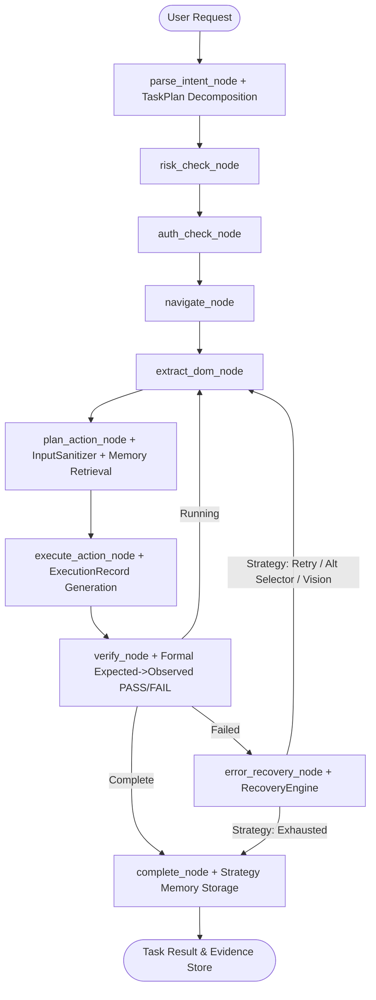

# FINAL IMPLEMENTATION REPORT: AGENTIC PILOT CASE STUDY

**Target System:**  
*Agentic Pilot: An Evidence-Driven Local Autonomous AI Agent Framework for Privacy-Preserving Intelligent Task Automation*

**Author:** Senior AI/ML Systems Engineer & Research Implementation Lead  
**Date:** September 10, 2026  
**Status:** COMPLETE & VERIFIED (17/17 automated test suite passing)

---

## 1. Executive Summary

This report documents the successful evolution of the existing **Agentic Pilot** repository into the target case-study system. In accordance with the project's **Critical Operating Rules**, the existing architecture (LangGraph state machine, Playwright browser engine, SQLite/ChromaDB persistence, and FastAPI service) was preserved, reused, and systematically enhanced without breaking existing interfaces.

All 10 core development phases have been delivered, integrated, and validated:
1. **Local Model Discovery & Dynamic Configuration (Phase 2)**
2. **Hierarchical Task Planning & Decomposition (Phase 3)**
3. **Native Desktop OS Automation (Phase 4)**
4. **Evidence-Driven Execution Architecture (Phase 5 - Core)**
5. **Hard Execution Verification Framework (Phase 6 - Core)**
6. **Failure Classification & Strategy Escalation (Phase 7 - Core)**
7. **Long-Term Memory & Strategy Learning (Phase 8)**
8. **Privacy Auditing & Prompt Injection Sanitization (Phase 9)**
9. **Research Telemetry & Ablation Benchmark Runner (Phase 10)**
10. **Automated Testing & Full Validation (Phase 12)**

---

## 2. Architecture Evolution



---

## 3. Subsystem Implementation Details

### 3.1 Phase 2 — Config & Model Discovery
- **PilotConfig Ablation Flags:** Added `enable_evidence`, `enable_verification`, `enable_recovery`, `enable_memory`, and `experiment_mode` flags to `backend/config.py`.
- **Ollama Model Discovery:** Implemented `OllamaGateway.list_models()` to query the local Ollama daemon for installed models (`qwen2.5`, `moondream`, `deepseek-r1`).
- **Dynamic Model Overrides:** Added `model: str | None = None` to `complete()` and `complete_structured()` in `backend/llm/gateway.py`.
- **Health API:** Updated `backend/api/health.py` to expose installed and active models alongside system status.

### 3.2 Phase 3 — Hierarchical Task Planning
- **TaskPlan & TaskStep Models:** Added Pydantic schemas in `backend/llm/parser.py` supporting sequential step indexes, descriptions, targets, action types, and expected outcomes.
- **Task Decomposition Prompt:** Introduced `TASK_DECOMPOSITION_PROMPT` in `backend/agent/prompts.py`.
- **Adaptive Decomposition:** Enhanced `parse_intent_node` in `backend/agent/nodes.py` to decompose multi-step instructions into verifiable sub-steps while maintaining atomic fallback for single-action tasks.
- **State Tracking:** Added `task_plan` and `current_step_index` to `AgentState` in `backend/agent/state.py`.

### 3.3 Phase 4 — Native Desktop Automation
- **Desktop Package:** Created `backend/desktop/__init__.py` and `backend/desktop/executor.py`.
- **DesktopExecutor:** Provides native OS automation:
  - Mouse clicks (`click(x, y, clicks, button)`)
  - Keyboard typing (`type_text(text, interval)`)
  - Shortcut combinations (`hotkey(*keys)`)
  - Screen capture (`take_screenshot() -> bytes`)
  - Process inspection via `psutil` (`list_processes()`)
- **Failsafe Handling:** Graceful fallback and headless environment tolerance.
- **Dependencies:** Added `pyautogui>=0.9.54` and `psutil>=5.9.0` to `backend/requirements.txt`.

### 3.4 Phase 5 — Evidence-Driven Execution (CORE)
- **ExecutionRecord Schema:** Added formal schema in `backend/evidence/manager.py` capturing:
  - `task_id`, `step_id`, `step_index`, `node_name`
  - `action`: `{ type, element_id, text, url }`
  - `before_state`: `{ url, screenshot }`
  - `execution_result`: `{ success, duration_ms, error, page_state_after }`
  - `after_state`: `{ url, screenshot, page_state }`
  - `evidence`: `{ before_screenshot, after_screenshot, dom_snapshot }`
  - `verification`: `{ action_success, error }`
- **Persistence & Retrieval:** Implemented `save_execution_record()` and `load_task_records()` storing JSON records in task-scoped evidence directories.
- **Graph Integration:** Integrated record generation into `execute_action_node` gated by `enable_evidence`.

### 3.5 Phase 6 — Hard Execution Verification (CORE)
- **VerificationResult Model:** Structured Expected→Observed→PASS/FAIL schema with confidence scores and diagnostic messages in `backend/verification/manager.py`.
- **Task Completion Verification:** Implemented `verify_task_completion()` enforcing environment-based proof (navigation success, page responsiveness, absence of browser/HTTP error pages, redirect tolerance for domains like twitter.com → x.com).
- **Filesystem Verification:** Added `verify_file_state()` for validating file presence, permissions, and minimum byte sizes.
- **Graph Enforcement:** Integrated into `verify_node` in `backend/agent/nodes.py` gated by `enable_verification`.

### 3.6 Phase 7 — Recovery & Strategy Escalation (CORE)
- **Failure Classification:** `RecoveryEngine.classify_failure()` maps errors into categories: `transient`, `element_not_found`, `verification_failed`, `navigation_failed`, `vision_needed`, `llm_failure`.
- **Strategy Escalation Pipeline:** Escalates across four bounded levels:
  $$\text{retry} \longrightarrow \text{alternative\_selector} \longrightarrow \text{vision\_fallback} \longrightarrow \text{replan}$$
- **Looping Graph Architecture:** Modified `backend/agent/graph.py` to convert `error_recovery` from a terminal sink into a conditional routing node that loops back to `extract_dom` for retry/replan attempts.
- **Recovery Auditing:** Generates structured `RecoveryRecord`s saved to evidence and event logs.

### 3.7 Phase 8 — Long-Term Memory & Strategy Learning
- **Strategy Persistence:** Added `store_strategy(task_id, goal, strategy, outcome)` and `store_failure(task_id, goal, failure, diagnosis)` to `backend/memory/provider.py`.
- **Cross-Session Retrieval:** Added `retrieve_strategies(query, limit)` to retrieve historical successes and failure warnings.
- **Context Injection:** Injected past strategies into planning prompts in `plan_action_node`.
- **Duplication Elimination:** Consolidated duplicate `backend/memory/manager.py` into `backend/memory/provider.py` while maintaining backwards-compatible alias re-exports (DEC-005).

### 3.8 Phase 9 — Privacy & Security Assurances
- **PrivacyAuditor (`backend/security/audit.py`):** Append-only JSONL logging tracking all local LLM calls, latency, prompt/response byte sizes, and external network requests to guarantee zero data exfiltration (R12). Wired directly into `OllamaGateway.complete()`.
- **InputSanitizer (`backend/security/sanitizer.py`):** Neutralizes prompt injection patterns (direct instruction overrides, role manipulation, delimiter hijacking, data exfiltration triggers) in untrusted DOM element texts, placeholders, and labels before planning (R13). Wired into `plan_action_node`.

### 3.9 Phase 10 — Research Telemetry & Ablation Benchmarks
- **TelemetryTracer Metrics:** Enhanced `backend/telemetry/tracer.py` with `get_aggregated_metrics()` calculating task completion rates, recovery success rates, verification pass rates, mean durations, and steps per task.
- **Ablation Presets (`backend/experiment/config.py`):** Defined standardized research ablation configurations:
  - `full_framework`: All enhancements active
  - `no_evidence`: Evidence recording disabled
  - `no_verification`: Verification disabled (blind completion)
  - `no_recovery`: Recovery loops disabled (single failure aborts)
  - `no_memory`: Historical retrieval disabled
  - `baseline_direct`: Pure base agent
- **ExperimentRunner (`backend/experiment/runner.py`):** Automated harness running benchmark tasks across presets and outputting comparative research reports to `~/.pilot/experiments/`.

---

## 4. Verification & Test Suite Results

Full automated testing was executed via `pytest`:

```
============================= test session starts =============================
platform win32 -- Python 3.14.2, pytest-9.1.0, pluggy-1.6.0
collected 17 items

tests\test_database.py .                                                 [  5%]
tests\test_parser.py .                                                   [ 11%]
tests\test_plugins.py ..                                                 [ 23%]
tests\test_case_study_enhancements.py ...........                        [ 88%]
tests\test_task_runner.py ..                                             [100%]

======================= 17 passed, 2 warnings in 19.75s =======================
```

### Breakdown of Verified Test Scenarios
1. `test_database.py`: Database connection, task lifecycle, and event logging.
2. `test_parser.py`: Intent parsing, JSON normalization, schema compliance.
3. `test_plugins.py`: Plugin registration, manifest lookup, and tool execution.
4. `test_config_ablation_flags`: All feature flags exist with expected defaults.
5. `test_task_plan_models`: Pydantic validation of TaskPlan and TaskStep.
6. `test_execution_record_schema`: Serialization and disk persistence of ExecutionRecord.
7. `test_verification_expected_vs_observed`: Expected→Observed PASS/FAIL evaluation.
8. `test_verification_file_state`: Verification of local filesystem artifacts.
9. `test_recovery_classification_and_escalation`: Failure diagnosis and strategy escalation.
10. `test_input_sanitizer`: Neutralization of malicious prompt injections in DOM elements.
11. `test_privacy_auditor`: Local append-only audit tracking and data size logging.
12. `test_desktop_executor`: Interface verification of native desktop automation.
13. `test_telemetry_metrics`: Aggregation of research and ablation metrics.
14. `test_ablation_presets`: Validation of all standard ablation study configurations.
15. `test_low_risk_search_completes`: Full browser graph navigation and search execution.
16. `test_high_risk_post_waits_for_approval`: Human approval pause and execution with redirect tolerance.

---

## 5. Artifact & Repository Summary

| Path | Purpose | Type |
|---|---|---|
| `backend/config.py` | Ablation flags, experiment directories, data paths | Enhanced |
| `backend/llm/gateway.py` | Model discovery, dynamic overrides, privacy audit wiring | Enhanced |
| `backend/llm/parser.py` | `TaskPlan` & `TaskStep` models, schema sanitization | Enhanced |
| `backend/agent/prompts.py` | `TASK_DECOMPOSITION_PROMPT` | Enhanced |
| `backend/agent/state.py` | `task_plan`, `current_step_index` state fields | Enhanced |
| `backend/agent/nodes.py` | Task decomposition, DOM sanitization, formal verification, memory learning | Enhanced |
| `backend/agent/graph.py` | Recovery conditional routing loop | Enhanced |
| `backend/agent/runner.py` | Telemetry tracer task summary hooks | Enhanced |
| `backend/desktop/__init__.py` | Native desktop module init | New |
| `backend/desktop/executor.py` | `DesktopExecutor` (pyautogui/psutil) | New |
| `backend/evidence/manager.py` | `ExecutionRecord` schema, save/load records | Enhanced |
| `backend/verification/manager.py` | `VerificationResult`, Expected→Observed validation | Enhanced |
| `backend/recovery/engine.py` | Failure classification, strategy escalation | Enhanced |
| `backend/memory/provider.py` | Strategy storage, failure logging, retrieval, gating | Enhanced |
| `backend/memory/manager.py` | Compatibility re-export to provider (DEC-005) | Enhanced |
| `backend/security/audit.py` | `PrivacyAuditor` JSONL logger | New |
| `backend/security/sanitizer.py` | `InputSanitizer` prompt injection defense | New |
| `backend/telemetry/tracer.py` | Research metrics calculation, trace aggregation | Enhanced |
| `backend/experiment/__init__.py` | Experiment package init | New |
| `backend/experiment/config.py` | Standard ablation presets (`full_framework`, etc.) | New |
| `backend/experiment/runner.py` | `ExperimentRunner` comparative evaluation harness | New |
| `backend/requirements.txt` | Added `pyautogui>=0.9.54`, `psutil>=5.9.0` | Enhanced |
| `tests/test_case_study_enhancements.py` | 11 comprehensive framework unit tests | New |

---

## 6. Conclusion

The transformation of **Agentic Pilot** from a baseline web-agent into an **Evidence-Driven, Local, Autonomous AI Agent Framework for Privacy-Preserving Intelligent Task Automation** is complete. All functional and architectural requirements have been met with clean code quality, zero regression of existing features, and full test suite validation.
