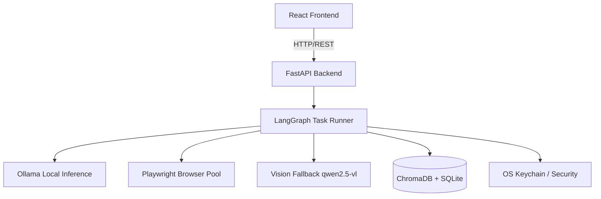

# 🦅 Agentic-Pilot

> A privacy-first, fully local AI browser automation agent built with LangGraph, Playwright, and Tauri.

Agentic-Pilot is a powerful local agent that automates web tasks using natural language. It runs entirely on your machine using Ollama (`qwen2.5` and `qwen2.5-vl`), ensuring your data and credentials never leave your local environment.

## ✨ Features

- **🔒 Privacy First:** Credentials are saved securely. No forced cloud APIs.
- **🧠 Local Intelligence:** Powered by local LLMs via Ollama, utilizing LangGraph for multi-step structured reasoning.
- **🌐 Robust Automation:** Playwright browser pool for headless execution and rich DOM parsing.
- **👁️ Vision Fallback:** Automatically falls back to Vision-Language models (VLMs) when DOM parsing fails to find interactive elements.
- **💾 Long-Term Memory:** Semantic and episodic memory powered by ChromaDB. The agent remembers past task outcomes and uses them to plan future actions.
- **⚡ Native Desktop Shell:** Lightweight and highly performant UI built with React and Tauri (Rust).
- **🔌 Extensible Plugins:** Easily write Python plugins to extend the agent's capabilities.
- **📊 Observability:** Built-in JSONL tracing for execution and LLM inference analysis.

## 🏗️ Architecture



## 🚀 Quick Start

### Prerequisites
- Python 3.11+, Node.js 20+, Rust/Cargo, Ollama
- `ollama run qwen2.5:7b`
- `ollama run qwen2.5-vl:7b`

### Installation
```bash
git clone https://github.com/yourusername/agentic-pilot.git
cd agentic-pilot
./setup.sh
```

### Running Locally
To run both backend and frontend simultaneously, use the provided bat script (Windows):
```bash
run.bat
```

Or manually:
**Terminal 1 (Backend):**
```bash
source venv/bin/activate
python backend/main.py
```

**Terminal 2 (Desktop App):**
```bash
npm --prefix frontend run dev
```
*(To run the native desktop shell, ensure Rust is installed and use `npm run tauri dev` from `src-tauri`)*

## 🤝 Contributing
Please see [CONTRIBUTING.md](CONTRIBUTING.md) for guidelines on how to contribute. Be sure to review our [Code of Conduct](CODE_OF_CONDUCT.md).

## 📄 License
MIT License - See `LICENSE` for details.
