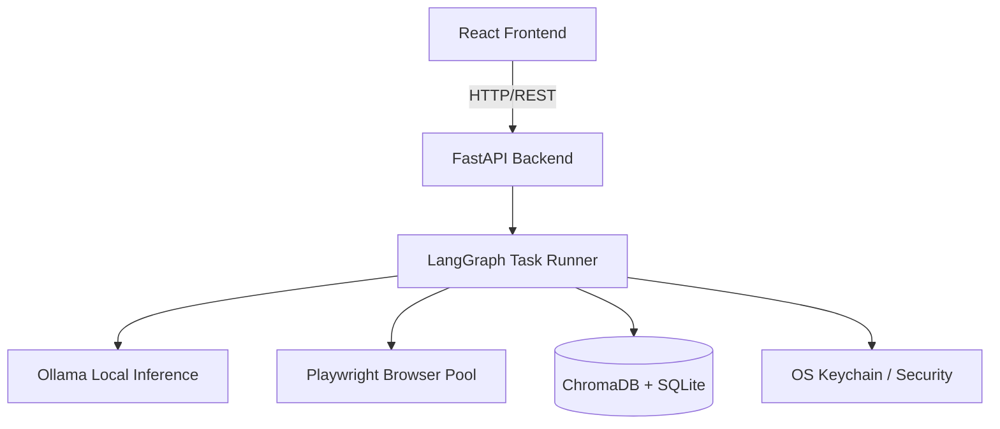

# 🦅 Agentic-Pilot

> A privacy-first, fully local AI browser automation agent built with LangGraph, Playwright, and Tauri.


Agentic-Pilot is a powerful local agent that automates web tasks using natural language. It runs entirely on your machine using Ollama (`qwen2.5`), ensuring your data and credentials never leave your local environment.

## ✨ Features

- **🔒 Privacy First:** Credentials are saved in your OS Keychain, never in plaintext. No forced cloud APIs.
- **🧠 Local Intelligence:** Powered by local LLMs via Ollama, utilizing LangGraph for multi-step structured reasoning.
- **🌐 Robust Automation:** Playwright browser pool for headless execution and rich DOM parsing.
- **⚡ Native Desktop Shell:** Lightweight and highly performant UI built with React and Tauri (Rust).
- **🔌 Extensible Plugins:** Easily write Python plugins to extend the agent's capabilities.

## 🏗️ Architecture



## 🚀 Quick Start

### Prerequisites
- Python 3.11+, Node.js 20+, Rust/Cargo, Ollama

### Installation
```bash
git clone https://github.com/yourusername/agentic-pilot.git
cd agentic-pilot
./setup.sh
```

### Running Locally
**Terminal 1 (Backend):**
```bash
source venv/bin/activate
python backend/main.py
```

**Terminal 2 (Desktop App):**
```bash
cd frontend
npm run tauri dev
```

## 🗺️ Roadmap & Future Work
- [ ] Implement robust human-in-the-loop approval UI flows
- [ ] Add support for multimodal Vision-Language Models (VLM) for screen parsing
- [ ] Cloud-sync integration for agent memory (Optional/Opt-in)

## 📄 License
MIT License - See [LICENSE](LICENSE) for details.
