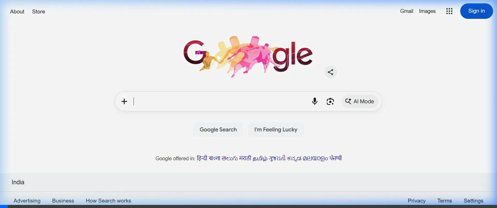
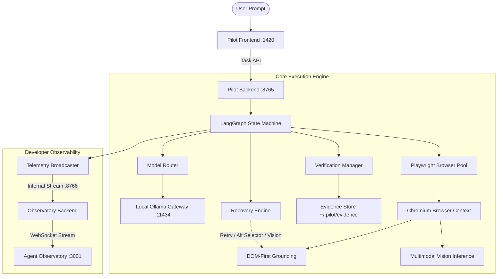

# Agentic Pilot

[](LICENSE)
[](https://www.python.org/downloads/)
[](https://nodejs.org/)
[](https://playwright.dev/)
[](https://github.com/langchain-ai/langgraph)
[](https://ollama.com)
[](docs/observability.md)

> **An Evidence-Driven, Privacy-Preserving Local Autonomous AI Agent Framework for Intelligent Task Automation.**

<p align="center">
  
</p>

---

## Overview

**Agentic Pilot** is an open-source, local-first autonomous AI agent framework engineered for robust web browser and desktop task automation.

Modern web agents often suffer from **premature completion hallucination**—declaring a task "finished" simply because a page was loaded or an unverified click occurred. Agentic Pilot solves this by enforcing an **evidence-driven execution model**: *every action must produce verifiable environmental proof before the system transitions to the next step or marks a task complete.*

### Why Local-First AI?
- **Zero Credential Leakage**: Web logins, session cookies, and private form data never leave your local environment or traverse third-party cloud LLM providers.
- **Cost & Rate Determinism**: Eliminates recurring API token costs and rate-limiting during complex, multi-step browser loops.
- **Offline & Air-Gapped Operation**: LLM reasoning, visual grounding, vector memory, and browser execution run entirely on local silicon.

### How It Works
Agentic Pilot combines **LangGraph state machine orchestration**, **Playwright Chromium browser automation**, and **local model routing (Qwen, Moondream, DeepSeek)**. By coupling DOM-first semantic heuristics with visual screenshot fallback, deterministic verification gates, and real-time execution observability, Agentic Pilot executes complex workflows reliably without blind assumptions.

---

## Key Features

| Category | Implemented Feature | Description |
|---|---|---|
| **Local Inference** | Multi-Model Routing | Dynamically routes between local LLMs (`planner`, `executor`, `vision`, `coder`, `fallback`) via Ollama with anti-thrashing cooldown. |
| **Orchestration** | LangGraph State Engine | Deterministic state machine with cycle-tolerant recovery loops and hierarchical task decomposition. |
| **Grounding** | DOM-First Heuristics | Prioritizes semantic HTML (ARIA, inputs, textareas, placeholders) before invoking vision models. |
| **Multimodal Vision** | Visual Coordinate Grounding | Utilizes local vision models (`qwen3-vl:2b`, `moondream`) for coordinate-based interaction when DOM parsing is ambiguous. |
| **Execution** | Playwright Automation | Headed or headless Chromium execution with persistent browser retention for post-task human inspection. |
| **Verification** | Hard Verification Gate | Rigorous Expected vs. Observed validation enforcing `ACTION_SUCCESS != TASK_SUCCESS`. |
| **Safety & Defense** | Anti-CAPTCHA Handling | Detects bot challenges (`/sorry/`, reCAPTCHA), halts execution in `BLOCKED` state, retains proof, and supports manual clearance or search fallback. |
| **Security** | Prompt Injection Sanitizer | Neutralizes adversarial prompt injections extracted from untrusted DOM element text prior to LLM planning. |
| **Telemetry** | Physical Evidence Store | Captures before/after screenshots, DOM snapshots, and structured `ExecutionRecord` JSON documents in `~/.pilot/evidence/`. |
| **Developer Tools** | Agent Observatory | Dedicated real-time dashboard (`:3001`) streaming internal reasoning, model choices, DOM trees, and latency profiles. |
| **Memory & RAG** | Episodic Strategy Learning | Stores past execution outcomes and strategies in SQLite / ChromaDB to inform future planning. |

*Note on Roadmap Items: Autonomous CAPTCHA cracking and automatic on-device model weight retraining are intentionally excluded to respect bot safety ethics and system stability.*

---

## Architecture

Agentic Pilot maintains a strict separation between the **Execution Core** and the **Developer Telemetry Pipeline**:


```mermaid
graph TD
    User([User Prompt]) --> PilotUI[Pilot Frontend :1420]
    PilotUI -->|Task API| PilotBackend[Pilot Backend :8765]

    subgraph Core Execution Engine
        PilotBackend --> LangGraph[LangGraph State Machine]
        LangGraph --> ModelRouter[Model Router]
        ModelRouter --> Ollama[Local Ollama Gateway :11434]
        
        LangGraph --> BrowserPool[Playwright Browser Pool]
        BrowserPool --> Chromium[Chromium Browser Context]
        
        Chromium --> Grounding[DOM-First Grounding]
        Chromium --> Vision[Multimodal Vision Inference]
        
        LangGraph --> Verifier[Verification Manager]
        Verifier --> Evidence[Evidence Store ~/.pilot/evidence]
        
        LangGraph --> Recovery[Recovery Engine]
        Recovery -.->|Retry / Alt Selector / Vision| Grounding
    end

    subgraph Developer Observability
        LangGraph --> Broadcaster[Telemetry Broadcaster]
        Broadcaster -->|Internal Stream :8766| ObsBackend[Observatory Backend]
        ObsBackend -->|WebSocket Stream| ObsUI[Agent Observatory :3001]
    end
```

For an in-depth architectural breakdown, see [docs/architecture.md](docs/architecture.md).

---

## Execution Lifecycle

Agentic Pilot executes tasks through a 15-stage pipeline:

```
1. User submits task
2. Hierarchical task decomposition into verifiable sub-steps
3. Risk assessment & human approval gate (if high risk)
4. Dynamic model selection (planner role)
5. Browser context acquisition & page navigation
6. Page readiness & network stabilization
7. Anti-CAPTCHA / bot challenge scan
8. DOM observation & semantic element grounding
9. Pre-action screenshot capture & evidence recording
10. Multimodal vision inference (if DOM grounding is inconclusive)
11. Physical action execution (Playwright click, type, navigate, extract)
12. Post-action screenshot & DOM observation
13. Deterministic verification (Expected vs. Observed state)
14. Failure recovery & strategy escalation (if verification fails)
15. Strategy persistence & task completion (browser retained for inspection)
```

### The Cardinal Rule: `ACTION_SUCCESS != TASK_SUCCESS`

In Agentic Pilot, the successful dispatch of an action does not equate to task completion:
- **Navigation Succeeded**: Reaching a target domain is only step 1; it does not satisfy the task.
- **Action Succeeded**: Playwright dispatched keystrokes without an error; the task is **not** complete until the target element is inspected and verified to contain the exact requested text.
- **Task Complete**: Attained only when environmental evidence satisfies all goal conditions.

---

## Evidence-Driven Execution

To eliminate hallucinated success, every operation writes immutable physical proof to `~/.pilot/evidence/<task_id>/`:
- **Pre-Action Screenshot**: Visual state of the page immediately prior to interaction.
- **Post-Action Screenshot**: Visual state of the page after interaction.
- **DOM Snapshots**: Serialized state of interactive elements and values.
- **Execution Records**: Structured JSON logs capturing timestamps, element IDs, typed text, and duration.
- **Verification Records**: Explicit comparison between expected criteria and observed DOM properties.

---

## Vision System

The multimodal vision subsystem bridges the gap when semantic HTML structures are absent:

```
[DOM Grounding Failure] ──> [Capture 1280x800 Screenshot] ──> [Invoke Local VLM] ──> [Predict Coordinates]
```

### Supported Models
1. **`qwen3-vl:2b` / `qwen2.5-vl:7b`**: Primary vision models for fine-grained spatial grounding, OCR, and complex UI layouts.
2. **`moondream`**: Fast, lightweight fallback vision model (1.8B) for constrained hardware environments.

> **Important Distinction**:
> Capturing a screenshot is **not** vision inference. A screenshot is recorded on every action as an audit artifact. Vision inference is only invoked when visual reasoning or coordinate grounding is explicitly required.

See [docs/vision.md](docs/vision.md) for further details.

---

## Task Verification

Agentic Pilot tests task completion using strict criteria:

```python
# Conceptual Verification Gate
if not page_responsive:
    return FAIL("Page unresponsive")
if is_error_or_sorry_page:
    return FAIL("Bot challenge or HTTP error page detected")
if not expected_text_in_dom(target_element):
    return FAIL("Target input text mismatch")
return PASS("All criteria satisfied")
```

| Scenario | Evaluation | Outcome |
|---|---|---|
| Navigated to search engine | Navigation succeeded | **Task Incomplete** |
| Dispatched keystrokes to input | Action succeeded | **Task Incomplete** |
| Verified input element contains required string & no error banners | Deterministic proof | **Task Completed** |

See [docs/verification.md](docs/verification.md) for full verification schemas.

---

## CAPTCHA & Bot-Challenge Handling

Agentic Pilot respects platform security boundaries and bot detection systems:
- **Detection**: DOM heuristics and URL inspectors continuously monitor for Google `/sorry/`, reCAPTCHA, Cloudflare Turnstile, and "unusual traffic" notices.
- **State Transition**: When detected, the task transitions immediately to **`BLOCKED`**.
- **No Automated Solving**: The framework **does not** attempt to bypass, break, or solve CAPTCHAs automatically.
- **Session Retention**: The browser remains open at the challenge page. The operator may:
  1. Solve the challenge manually in the open browser and click **Resume**.
  2. Switch to an alternative search provider (e.g., DuckDuckGo) via the fallback engine.

---

## Agent Observatory

The **Pilot Agent Observatory** is an independent, real-time developer telemetry dashboard running on port `3001`:

<p align="center">
  
</p>

- **URL**: `http://127.0.0.1:3001` (Backend on `8766`)
- **Read-Only**: Pure consumer of telemetry events; cannot alter agent state or send browser commands.
- **Live Capabilities**:
  - Visual proof carousel with 1280x800 pre/post-action screenshots.
  - Real-time model routing telemetry (active model, role, latency, fallback status).
  - Chronological event timeline with structured payloads.
  - Interactive DOM inspection table with bounding box coordinates.
  - Historical run selector for replaying past agent executions.

See [docs/observability.md](docs/observability.md) for full observatory documentation.

---

## Privacy & Local Execution

Agentic Pilot is built from the ground up for local execution:
- **Local Inference**: All language and vision reasoning runs on local hardware via Ollama.
- **Local Database**: Task history, events, and credentials (stored in OS keychain via `keyring`) remain on the host machine.
- **External Network Boundaries**: The browser naturally connects to target websites specified in tasks. Outbound requests and payload sizes are logged by `PrivacyAuditor` (`~/.pilot/logs/privacy_audit.jsonl`) to ensure no data exfiltration occurs behind the scenes.

---

## Installation

### Prerequisites
- **Python**: 3.11 or newer
- **Node.js**: 20 LTS or newer
- **Playwright Chromium**: Browser binaries
- **Ollama**: Local model runtime ([ollama.com](https://ollama.com))

### 1. Clone the Repository
```bash
git clone https://github.com/sudeshsudhii/Agentic-pilot-local.git
cd Agentic-pilot-local
```

### 2. Python Environment Setup
```bash
python -m venv .venv
# On Windows:
.venv\Scripts\activate
# On Linux/macOS:
source .venv/bin/activate

pip install -r backend/requirements.txt
playwright install chromium
```

### 3. Frontend Setup
```bash
# Install Pilot User Interface dependencies
cd frontend && npm install && cd ..

# Install Agent Observatory dependencies
cd observatory/frontend && npm install && cd ..
```

### 4. Pull Local Models
```bash
ollama pull qwen2.5:1.5b
ollama pull moondream
# Recommended for higher reasoning & coding:
ollama pull qwen2.5:7b
ollama pull qwen2.5-coder:3b
```

---

## Configuration

Copy the configuration template:
```bash
cp .env.example .env
```

Key environment variables (see [docs/configuration.md](docs/configuration.md) for the full list):
```ini
# Local LLM Gateway
PILOT_OLLAMA_BASE_URL=http://127.0.0.1:11434
PILOT_OLLAMA_MODEL=qwen2.5:1.5b
PILOT_OLLAMA_VISION_MODEL=moondream

# Ports
PILOT_SERVER_PORT=8765
PILOT_HEADLESS_BROWSER=false
PILOT_KEEP_BROWSER_OPEN=true

# Feature Flags
PILOT_ENABLE_EVIDENCE=true
PILOT_ENABLE_VERIFICATION=true
PILOT_ENABLE_RECOVERY=true
```

---

## Running Agentic Pilot

### Unified Python Launcher
Launch all services simultaneously with process orchestration and graceful port management:
```bash
python main.py
```

#### CLI Options
```bash
python main.py --help          # Display all options
python main.py --backend-only  # Run only the backend API server (:8765)
python main.py --no-browser    # Start without auto-launching web browser
python main.py --test          # Run automated test suite
python main.py --eval          # Run research ablation benchmarks
python main.py --stop          # Stop all running background Pilot services
```

*(On Windows, running `start_all.bat`, `run.bat`, `stop.bat`, or `start_observatory.bat` forwards directly to `python main.py`)*

### Service Endpoints
| Application | URL | Purpose |
|---|---|---|
| **Pilot User Interface** | `http://127.0.0.1:1420` | Primary task submission & control |
| **Pilot Backend API** | `http://127.0.0.1:8765` | REST & WebSocket agent server |
| **Observatory Backend** | `http://127.0.0.1:8766` | Real-time telemetry ingestion server |
| **Agent Observatory** | `http://127.0.0.1:3001` | Developer telemetry & visual proof dashboard |

---

## Verified Example Task

Here is a verified task demonstrating the DOM-first grounding, keystroke typing, and exact verification loop:

### Task Prompt
```
Open https://cp.sudhii.in

Find the main text input field.

Enter:
hii i am agentic ai powered by local llm qwen

Do NOT click Save.
Do NOT submit.
Do NOT press Enter.
Verify the exact text.
```

### Execution Progression
1. **Navigate**: Opens `https://cp.sudhii.in/` and waits for DOM ready state.
2. **Observe**: Scans interactive DOM elements; takes pre-action screenshot.
3. **Ground**: Semantic heuristics identify the primary textarea (`pilot-el-10`).
4. **Type**: Dispatches text without triggering form submission or Enter keys.
5. **Verify**: Inspects active DOM value; confirms string matches exactly; verifies page is responsive.
6. **Complete**: Records proof screenshot and retains browser session for operator inspection.

---

## Testing

Agentic Pilot includes an automated test suite comprising **109 passing tests** with 0 failures:

```bash
# Run full automated regression suite
python -m pytest

# Run by subsystem
python -m pytest tests/test_case_study_enhancements.py -v       # Core framework & verification
python -m pytest tests/test_captcha_handling.py -v              # CAPTCHA & blocked states
python -m pytest tests/test_navigation_transition_and_typing.py -v # DOM typing & verification
python -m pytest tests/test_model_router.py -v                 # Dynamic model routing
python -m pytest tests/test_rag_integration.py -v              # RAG & episodic memory
python -m pytest observatory/tests/test_observatory.py -v      # Real-time telemetry & events
```

---

## Project Structure

```
Agentic-pilot-local/
├── backend/                  # FastAPI backend & Agent Core
│   ├── agent/                # LangGraph state machine, nodes, prompts, runner
│   ├── api/                  # REST endpoints (tasks, health, approvals)
│   ├── browser/              # Playwright browser pool, DOM parser, executor
│   ├── db/                   # SQLite persistence for tasks and events
│   ├── desktop/              # Native OS automation (PyAutoGUI / psutil)
│   ├── evidence/             # Screenshot and ExecutionRecord storage
│   ├── experiment/           # Research benchmarks & ablation presets
│   ├── llm/                  # Ollama gateway, multi-model router, registry
│   ├── memory/               # Episodic memory provider (ChromaDB / SQLite)
│   ├── rag/                  # Chunking, context builder, vector retrieval
│   ├── recovery/             # Failure classification & strategy escalation
│   ├── security/             # Prompt injection sanitizer, privacy auditor
│   ├── telemetry/            # Research tracer & real-time event broadcaster
│   ├── verification/         # Expected vs Observed verification engine
│   ├── vision/               # Multimodal vision provider & fallbacks
│   ├── config.py             # Runtime settings (PilotConfig)
│   ├── main.py               # Backend entry point (:8765)
│   └── requirements.txt      # Python dependencies
├── docs/                     # Technical documentation suite
│   ├── architecture.md       # Detailed subsystem architecture
│   ├── agent-lifecycle.md    # 15-step execution lifecycle
│   ├── vision.md             # Multimodal vision & grounding guide
│   ├── verification.md       # Task verification framework
│   ├── observability.md      # Agent Observatory deep dive
│   ├── configuration.md      # Complete configuration guide
│   ├── development.md        # Contributor & developer guide
│   └── troubleshooting.md    # Diagnosis & issue resolution
├── frontend/                 # React + TypeScript User Interface (:1420)
├── observatory/              # Dedicated Developer Telemetry Application
│   ├── backend/              # Streaming telemetry server (:8766)
│   ├── frontend/             # Real-time React dashboard (:3001)
│   └── tests/                # Observatory telemetry test suite
├── plugins/                  # Extensible tool plugins (gmail, twitter, etc.)
├── tests/                    # 100+ automated test suite
├── .env.example              # Configuration environment template
├── .gitignore                # Production git exclusion rules
├── LICENSE                   # MIT License
├── main.py                   # Unified Python service orchestrator
└── README.md                 # Project documentation
```

---

## Security & Safety

- **Zero Exfiltration**: No user data, prompts, or browser screenshots are sent to external cloud APIs.
- **OS Credential Keychain**: Sensitive credentials are stored via system-native keyrings (`keyring`), never in plaintext `.env` files.
- **Prompt Injection Defense**: Untrusted text extracted from web pages is scrubbed by `InputSanitizer` before injection into LLM prompts.
- **Approval Gates**: High-risk actions (financial transactions, bulk data deletions) trigger mandatory human-in-the-loop approvals.

---

## Known Limitations

- **Bot Challenges**: Cannot autonomously solve reCAPTCHA or Cloudflare challenges; requires operator intervention or search provider fallback.
- **Local Model Latency**: Inference speed depends on local hardware (CPU/GPU) and model parameter size.
- **Dynamic Canvas Webapps**: Webapps rendering UI strictly via `<canvas>` or WebGL require visual coordinate grounding rather than semantic DOM extraction.

---

## Roadmap

- [ ] Richer semantic trajectory replay in the Observatory.
- [ ] Multi-agent collaborative execution (Researcher + Planner + Verifier).
- [ ] Enhanced browser fingerprint randomization for anti-bot tolerance.
- [ ] Direct accessibility-tree grounding via Chromium CDP.
- [ ] Exportable JSON execution reports for automated compliance auditing.

---

## Contributing

Contributions are welcome! Please follow these steps:
1. Fork the repository.
2. Create a feature branch (`git checkout -b feature/my-feature`).
3. Ensure all tests pass (`python -m pytest`).
4. Commit your changes (`git commit -m 'feat: add my feature'`).
5. Push to the branch (`git push origin feature/my-feature`).
6. Open a Pull Request.

---

## License

This project is licensed under the [MIT License](LICENSE).

---

## Acknowledgements

- [LangGraph](https://github.com/langchain-ai/langgraph) for state graph orchestration.
- [Playwright](https://playwright.dev/) for reliable browser automation.
- [Ollama](https://ollama.com/) for local model serving.
- [Qwen Team / Alibaba](https://github.com/QwenLM) for the open-weights Qwen2.5 and Qwen-VL models.
- [ChromaDB](https://www.trychroma.com/) for vector embedding storage.
- [FastAPI](https://fastapi.tiangolo.com/) for backend services.
- [Vite](https://vitejs.dev/) & [React](https://react.dev/) for responsive web interfaces.
