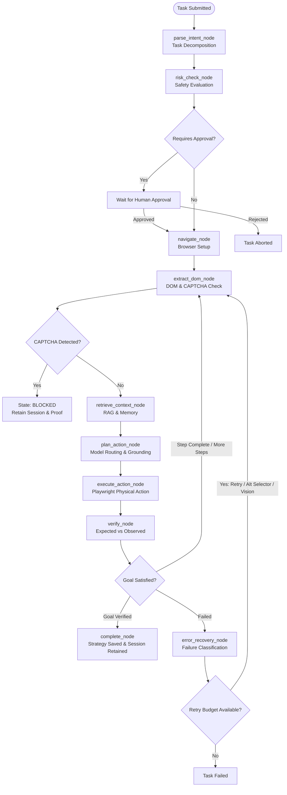

# Agentic Pilot — Agent Execution Lifecycle

This document describes the end-to-end execution lifecycle of a task in Agentic Pilot.

---

## 1. Lifecycle Diagram

---

## 2. Execution Step Pipeline

| Step # | Node Name | Operation & Responsibility |
|---|---|---|
| **1** | `parse_intent_node` | Decomposes raw natural language into structured `TaskPlan` sub-steps, identifying target URLs, keywords, and constraints. |
| **2** | `risk_check_node` | Evaluates destructive actions (payments, form submissions, deletions, file mutations) and classifies risk (`low`, `medium`, `high`). |
| **3** | `auth_check_node` | Low-risk tasks proceed automatically; high-risk tasks pause and await human operator confirmation via UI or API. |
| **4** | `navigate_node` | Launches or reuses a browser context, navigates to the initial target site, and waits for network idle / page load. |
| **5** | `extract_dom_node` | Scans interactive DOM elements; evaluates heuristic accessibility candidates; tests for CAPTCHA/bot challenge pages. |
| **6** | `retrieve_context_node` | Queries local ChromaDB collection for domain documentation (RAG) and historical task strategies (episodic memory). |
| **7** | `plan_action_node` | Routes task intent to the optimal local model role; sanitizes untrusted input; generates structured `PlannedAction`. |
| **8** | `execute_action_node` | Takes pre-action screenshot; performs physical browser action (click, type, navigate, extract); takes post-action screenshot. |
| **9** | `verify_node` | Compares expected outcome against actual physical DOM changes, element values, and URL state. |
| **10** | `error_recovery_node` | If verification fails, categorizes error and escalates through recovery strategies (retry $\rightarrow$ alternative selector $\rightarrow$ vision fallback $\rightarrow$ replan). |
| **11** | `complete_node` | Writes physical evidence manifest, saves task strategy to memory, and optionally keeps the browser session open for inspection. |

---

## 3. Core Principle: `ACTION_SUCCESS != TASK_SUCCESS`

A foundational architectural constraint in Agentic Pilot is the separation of action execution from task completion:

1. **Action Success**: Playwright was able to execute a click or send keystrokes without throwing an exception.
2. **Task Success**: The intended business goal or page state has been independently verified.

> **Example**:
> - Reaching `https://www.google.com/` is a successful navigation action. It does **NOT** complete a task that requested searching for information.
> - Typing text into an input field confirms keystroke dispatch. It does **NOT** complete the task until the input's actual value is verified in the DOM.
