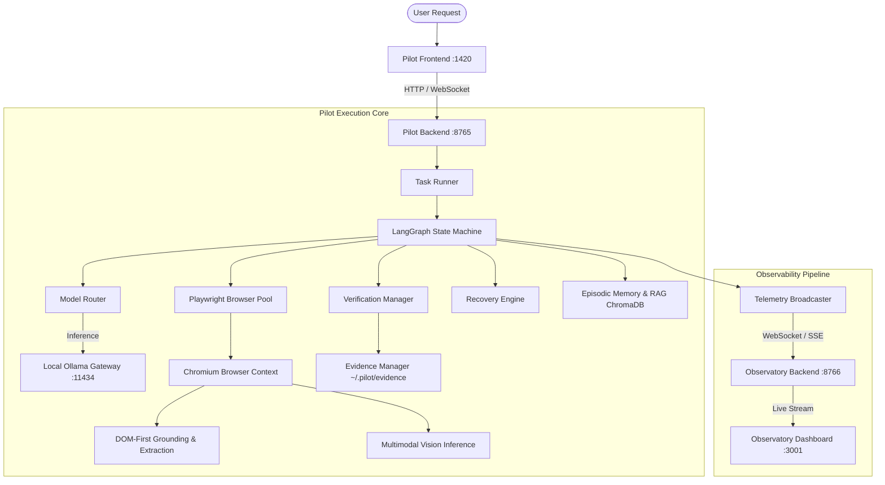

# Agentic Pilot — System Architecture

**Agentic Pilot** is an evidence-driven, privacy-preserving local autonomous AI agent framework designed for reliable task automation across web browsers and native desktop applications.

Unlike conventional LLM wrappers or script-based macros, Agentic Pilot integrates structured multi-step reasoning, dynamic local model routing, deterministic verification, physical evidence collection, and real-time execution observability.

---

## 1. High-Level Architecture

The framework consists of two primary operational domains:
1. **Pilot Execution Engine** (Core Agent + FastAPI + Playwright + Local LLM)
2. **Pilot Agent Observatory** (Real-Time Developer Telemetry Dashboard)

---

## 2. Core Subsystems

### 2.1 LangGraph State Machine Orchestration
The execution flow is modeled as a state graph with explicit node boundaries and state immutability.
- **State Schema (`AgentState`)**: Tracks intent, task plans, active step indices, DOM manifests, action histories, verification records, model routing metadata, and risk approvals.
- **Looping & Escalation**: Rather than failing abruptly or hallucinating progress, the state graph routes through conditional edges to escalate failed actions into alternative DOM selectors, visual grounding, or user clarification.

### 2.2 Dynamic Model Router
Local LLM operations are routed dynamically based on task requirements:
- **Planner / Reasoning**: Higher-capacity local models (e.g., `qwen2.5:7b`, `deepseek-r1:1.5b`) for intent decomposition and multi-step strategy planning.
- **Executor / Grounding**: Fast instruction-tuned models (e.g., `qwen2.5:1.5b`) for low-latency element selection.
- **Vision Specialist**: Multimodal models (`qwen3-vl:2b`, `moondream`) for coordinate-based visual grounding.
- **Coder**: Specialized models (e.g., `qwen2.5-coder:3b`) for script synthesis.
- **Anti-Thrashing Cooldown**: Enforces step-level stability to prevent rapid model swapping in memory.

### 2.3 Browser Automation & Grounding
- **Dedicated Pool (`browser_pool.py`)**: Manages browser lifecycles, contexts, and cleanup.
- **DOM-First Grounding**: Prioritizes semantic HTML structures (IDs, ARIA labels, input roles, placeholders) before invoking visual models.
- **Session Retention**: Retains the browser window open after task completion so human operators can inspect the final live page.

### 2.4 Evidence & Hard Verification
- **Physical Proof**: Every action produces before/after screenshots and DOM trees.
- **Verification Rule**: `ACTION_SUCCESS != TASK_SUCCESS`. A browser action succeeding (e.g. typing text) does not mark the task complete until the target state is physically verified on the page.

### 2.5 Real-Time Observability
- All events are broadcast asynchronously without adding latency to the execution loop.
- The **Agent Observatory** consumes this event stream on independent ports (`8766`/`3001`), completely decoupled from the user-facing application.
