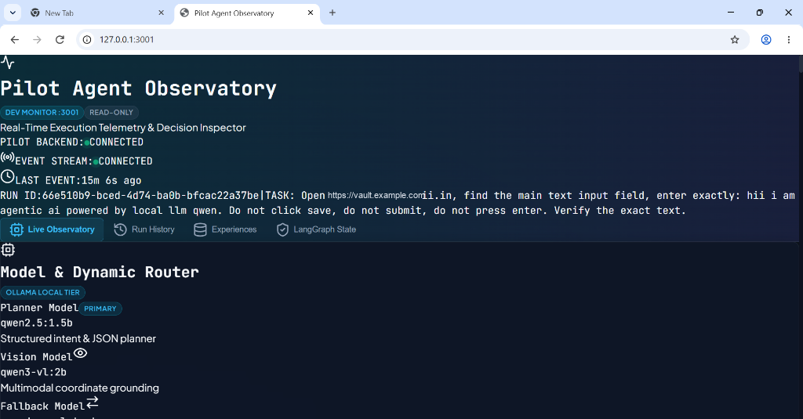
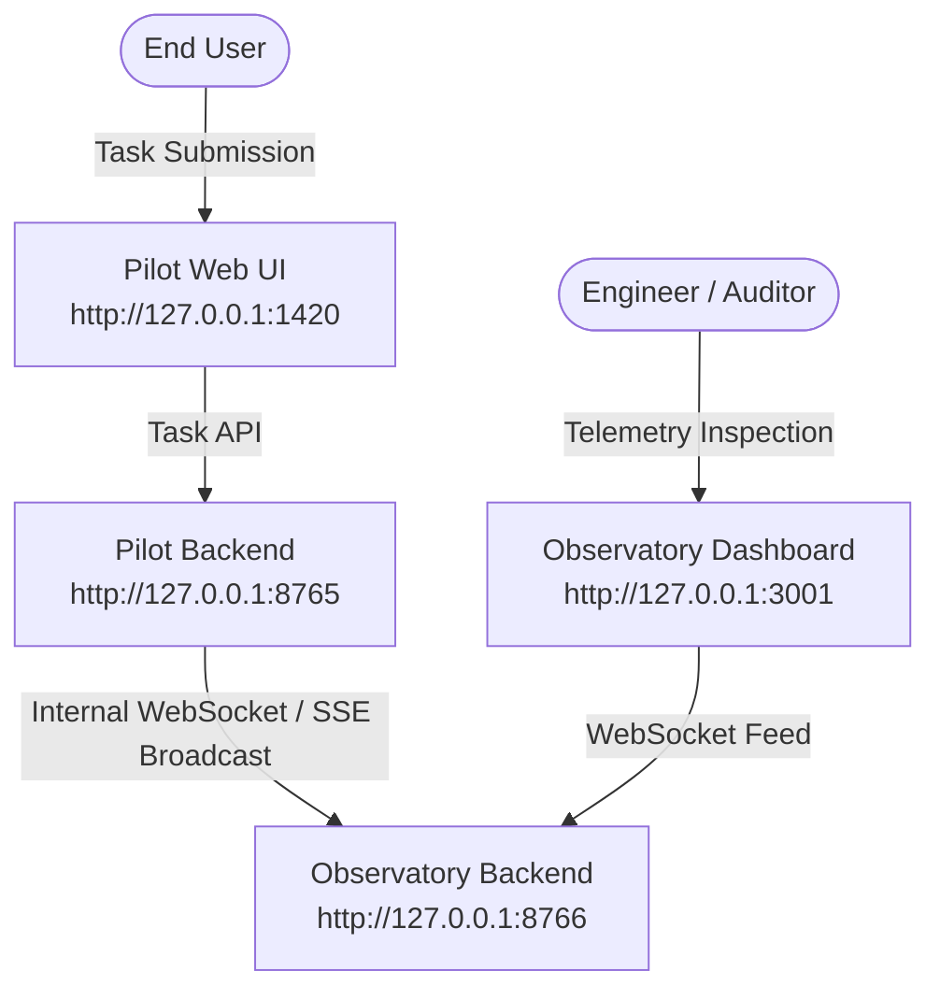

# Agentic Pilot — Agent Observatory

The **Pilot Agent Observatory** is a dedicated, real-time developer telemetry application that provides full internal visibility into agent reasoning, browser operations, DOM interactions, and verification lifecycles.

<p align="center">
  
</p>

---

## 1. Network & Port Architecture

The Observatory is completely decoupled from the primary application to ensure that telemetry monitoring does not interfere with task execution:



| Component | Default URL | Purpose | Access Mode |
|---|---|---|---|
| **Pilot Frontend** | `http://127.0.0.1:1420` | User task submission & high-level status | Interactive |
| **Pilot Backend** | `http://127.0.0.1:8765` | FastAPI agent execution & LangGraph state machine | Service API |
| **Observatory Backend** | `http://127.0.0.1:8766` | Real-time event ingestion, ring buffer, history | Streaming API |
| **Observatory Dashboard** | `http://127.0.0.1:3001` | Deep inspection, visual proof, latency metrics | **Read-Only** |

---

## 2. Core Architectural Guarantees

1. **Strictly Read-Only**: The Observatory cannot send commands, dispatch browser events, or alter agent state.
2. **Zero Execution Overhead**: Telemetry events are dispatched non-blockingly via asyncio queues; execution never stalls if the Observatory is offline.
3. **Sensitive Data Redaction**: API keys, auth tokens, passwords, and cookie headers are sanitized prior to broadcasting.
4. **Historical Replay**: The backend maintains a rolling buffer of previous task runs accessible via the run selector.

---

## 3. Telemetry Event Schema

Telemetry events are structured as `ObservatoryEvent` objects:

```json
{
  "event_id": "142",
  "run_id": "66e510b9-bced-4d74-ba0b-bfcac22a37be",
  "task_id": "66e510b9-bced-4d74-ba0b-bfcac22a37be",
  "timestamp": "2026-09-11T06:32:03.422Z",
  "event_type": "VERIFICATION_PASSED",
  "status": "running",
  "step_index": 1,
  "message": "Task goal verified and satisfied",
  "metadata": {
    "verified": true,
    "confidence": 1.0,
    "url": "https://vault.example.com/",
    "text_verified": "hii i am agentic ai powered by local llm qwen"
  }
}
```

---

## 4. Dashboard Panels

1. **Execution Status Bar**: Displays current task ID, run status (`running`, `blocked`, `completed`, `failed`), active URL, and step counter.
2. **Visual Proof Carousel**: High-resolution 1280x800 screenshots captured before and after actions, with zoom and step navigation.
3. **Model Routing Telemetry**: Live cards showing the active model selected for the current role (`planner`, `executor`, `vision`), routing reason, and inference latency.
4. **DOM Grounding Inspector**: Table of extracted interactive elements, showing element IDs, roles, tags, bounding box coordinates, and visibility flags.
5. **Real-Time Event Stream**: Color-coded, chronological event feed tracking every decision, keystroke, navigation event, and verification check.
