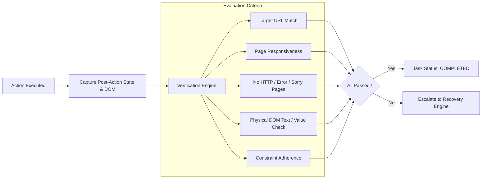

# Agentic Pilot — Task Verification Framework

A major vulnerability in autonomous web agents is **premature completion hallucination**, where an agent marks a task as finished simply because it navigated to a page or fired a keystroke event.

Agentic Pilot prevents this failure mode using a **Hard Verification Engine** (`backend/verification/manager.py`) that evaluates physical post-action evidence against expected criteria before terminating execution.

---

## 1. The Verification Gate



---

## 2. Verification Hierarchy

| Level | Condition | Evaluation Result | Reasoning |
|---|---|---|---|
| ❌ **Navigation Alone** | Browser reached `https://example.com` | **NOT SUFFICIENT** | Visiting the target domain is only step 1 of an overall workflow. |
| ❌ **Action Execution** | Playwright dispatched keystrokes without throwing | **NOT SUFFICIENT** | Keystrokes may have typed into the wrong element or been cleared by JavaScript. |
| ❌ **LLM Self-Report** | LLM outputs "I have completed the task" | **NOT SUFFICIENT** | Model reasoning cannot be trusted without physical ground truth. |
| ✅ **Deterministic Evidence** | DOM inspection confirms target value exists in input, URL matches, page is responsive, and no error banners exist | **SUFFICIENT** | Physical environmental proof verified. |

---

## 3. Structured Verification Schema

Every verification invocation outputs a formal structured `VerificationResult`:

```python
class VerificationResult(BaseModel):
    verified: bool                     # True only when all checks pass
    confidence: float                  # Heuristic certainty (0.0 to 1.0)
    expected_state: dict[str, Any]     # What the task required
    observed_state: dict[str, Any]     # Physical reality extracted from DOM
    mismatches: list[str]              # Concrete discrepancies
    error_message: str | None = None   # Actionable explanation if failed
```

### Concrete Verification Example

**User Instruction:**
> "Open https://vault.example.com, find the main text input, and type: 'hii i am agentic ai'. Do NOT click Save. Verify the exact text."

**Observed Evaluation:**
```json
{
  "verified": true,
  "confidence": 1.0,
  "expected_state": {
    "task_completed": true,
    "has_error_state": false,
    "text_verified": "hii i am agentic ai"
  },
  "observed_state": {
    "page_title": "Example Vault",
    "page_url": "https://vault.example.com/",
    "page_responsive": true,
    "has_error_state": false,
    "text_verified": "hii i am agentic ai",
    "task_completed": true
  },
  "mismatches": []
}
```
If the textarea had contained an empty string or partial text, `verified` would evaluate to `False`, forcing the recovery engine to retry rather than falsely concluding.
