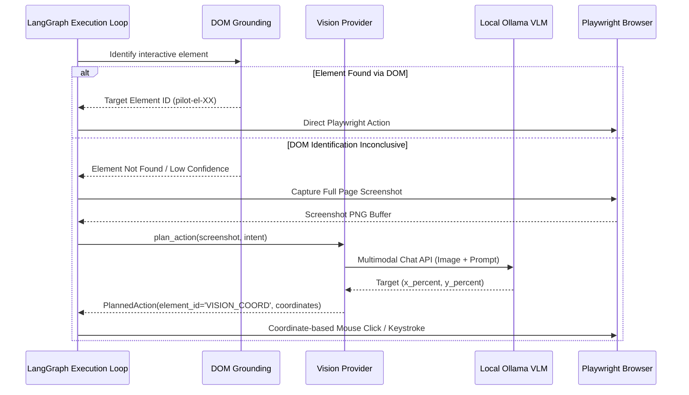

# Agentic Pilot — Vision Architecture & Grounding

Agentic Pilot incorporates a multimodal vision subsystem designed to visually ground interactive UI elements when semantic DOM trees are ambiguous, dynamic, or non-standard (such as canvas elements, complex SPAs, or custom web components).

---

## 1. Distinction: Screenshot vs. Vision Inference

In Agentic Pilot, visual evidence capture is decoupled from neural vision inference:

| Concept | Event Type | Description |
|---|---|---|
| **Screenshot Captured** | `SCREENSHOT_CAPTURED` | Physical screen capture saved to disk and streamed to the Observatory for auditability and verification. **No LLM inference is triggered.** |
| **Vision Inference** | `VISION_STARTED` / `VISION_COMPLETED` | The captured screenshot is serialized and transmitted to a local Vision-Language Model (VLM) via Ollama to compute bounding boxes or coordinate actions. |

> [!IMPORTANT]
> A task capturing a screenshot does **not** imply that a vision model was invoked. Vision models are only engaged when DOM heuristics fail, when an explicit visual grounding strategy is chosen, or during visual fallback recovery.

---

## 2. Supported Local Vision Models

Agentic Pilot interfaces with local multimodal models hosted via Ollama:

| Model Identifier | Role | Strengths | Typical Use Case |
|---|---|---|---|
| `qwen3-vl:2b` / `qwen2.5-vl:7b` | Primary Vision Model | High resolution comprehension, accurate text recognition in images, spatial reasoning. | Primary visual grounding, complex UI button localization. |
| `moondream` | Fallback Vision Model | Ultra-compact (1.8B), minimal memory footprint, rapid inference. | Low-resource environments or rapid coordinate confirmation. |

---

## 3. Visual Grounding Workflow

---

## 4. Graceful Degradation & Unavailable Fallback

If no local vision model is installed or if the Ollama daemon returns a multimodal incompatibility error (`VISION_UNAVAILABLE`):
1. An explicit `VISION_UNAVAILABLE` event is recorded.
2. The agent degrades gracefully without crashing.
3. The recovery engine escalates to alternative CSS selectors, text search heuristics, or requests operator intervention.
