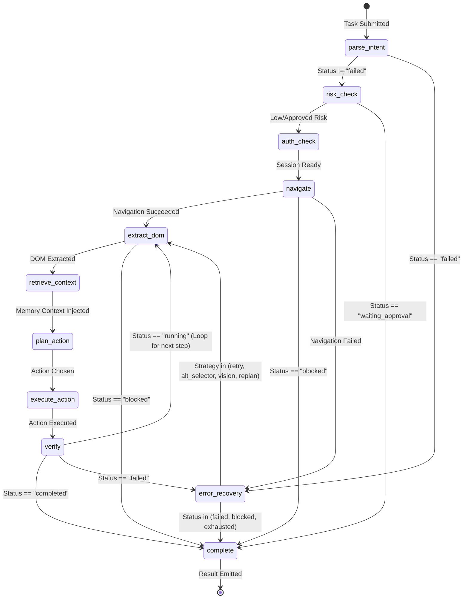
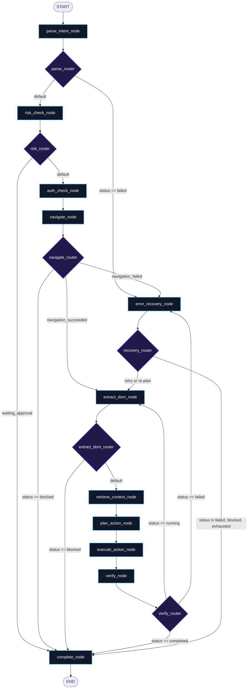

# Agent Execution Lifecycle

The execution lifecycle of **Agentic Pilot** is governed by an asynchronous, cyclic state machine implemented using **LangGraph**. Unlike traditional autonomous agent architectures that rely on unbounded ReAct (Reason + Act) text loops, Agentic Pilot enforces formal graph nodes, typed state transitions, and deterministic conditional routing.

---

## LangGraph State Machine Diagram

The compiled graph consists of 11 distinct nodes connected via static and conditional edges.



---

## State Transition & Conditional Routing Architecture



---

## Detailed Node Responsibilities

### 1. `parse_intent_node` (`backend/agent/nodes.py`)
* **Purpose**: Analyzes the raw user prompt (`input_text`) using a local text model (`qwen2.5:1.5b` or configured fallback).
* **Outputs**: Extracts initial target URL, intended goal, and generates an initial multi-step `TaskPlan` array.
* **Routing**: If intent parsing yields an unparseable instruction, transitions to `error_recovery`; otherwise proceeds to `risk_check`.

### 2. `risk_check_node`
* **Purpose**: Evaluates planned actions against safety criteria (financial transactions, credential submission, account deletion).
* **Outputs**: Assigns `risk_level` (`low`, `medium`, `high`).
* **Routing**: If high-risk and unapproved, sets `status="waiting_approval"` and routes to `complete` (awaiting human authorization).

### 3. `auth_check_node`
* **Purpose**: Inspects whether the target domain requires authenticated session tokens or existing browser storage state (`cookies`, `localStorage`).
* **Outputs**: Loads stored session profiles into the active Playwright context if configured.

### 4. `navigate_node`
* **Purpose**: Navigates the Playwright browser to `current_url` with timeout and anti-bot evasions enabled.
* **Outputs**: Updates `navigation_succeeded=True/False`, records navigation latency, and verifies HTTP status.
* **Routing**: On DNS failure or connection drop, routes to `error_recovery`. If anti-bot CAPTCHA is detected, flags `blocked` and terminates to `complete`.

### 5. `extract_dom_node`
* **Purpose**: Scrapes the current page state, filtering out non-interactive layout nodes to construct an accessibility tree.
* **Outputs**: Captures screenshot bytes, computes SHA-256 hash, and lists interactive elements with assigned IDs.
* **Special Handling**: If CAPTCHA or Cloudflare challenge elements are detected in the DOM, updates `status="blocked"`.

### 6. `retrieve_context_node`
* **Purpose**: Queries the local ChromaDB vector store (`pilot_memories`) using the current domain and step goal.
* **Outputs**: Injects `retrieved_memories` and `retrieved_knowledge` into the state, warning the planner about previously failed selectors or successful workflows.

### 7. `plan_action_node`
* **Purpose**: The core decision node. Invokes the `ModelRouter` to select an LLM, injects the pruned DOM tree and retrieved experiences, and emits a structured `PlannedAction`.
* **Action Types**: `click`, `type_text`, `select_option`, `navigate`, `scroll`, `wait`, `complete`.

### 8. `execute_action_node`
* **Purpose**: Dispatches the planned action to Playwright via `ActionExecutor`.
* **Fallback**: If the selector fails or the element is not found, delegates immediately to `VisionFallback` coordinate grounding.

### 9. `verify_node`
* **Purpose**: Executes post-action hard verification using `VerificationManager`.
* **Checks**:
  * Did the URL change as expected?
  * Did the DOM undergo meaningful structural mutation?
  * Was the exact text string verified inside the input field?
* **Routing**: If verification fails, transitions to `error_recovery`. If verified and subgoals remain, loops back to `extract_dom`. If final goal reached, transitions to `complete`.

### 10. `error_recovery_node`
* **Purpose**: Implements strategy escalation when an action or verification fails.
* **Ladder**: `retry` → `alternative_selector` → `vision_fallback` → `replan`.
* **Routing**: If retries remain, loops back to `extract_dom` with updated strategy instructions. If max retries are exceeded, marks `status="exhausted"` and transitions to `complete`.

### 11. `complete_node`
* **Purpose**: Final state execution. Closes or recycles browser pages, logs execution metrics, writes episodic summaries to SQLite/ChromaDB, and formats the final answer.

---

## The `AgentState` Specification

All nodes mutate and share a single unified `AgentState` object (`backend/agent/state.py`):

```python
class AgentState(TypedDict):
    task_id: str
    input_text: str
    parsed_intent: ParsedIntent | None
    current_url: str | None
    action_manifest: ActionManifest | None
    action_history: list[ActionResult]
    retry_count: int
    status: str                         # "running", "completed", "failed", "blocked", "waiting_approval"
    approval_id: str | None
    error: str | None
    result: dict | None
    plugin_id: str | None
    llm_call_count: int
    planned_action: PlannedAction | None
    approved: bool
    navigation_succeeded: bool
    session_id: str | None
    task_plan: TaskPlan | None
    current_step_index: int
    retrieved_knowledge: list[dict] | None
    retrieved_memories: list[dict] | None
    retrieval_metadata: dict | None
    selected_model: str | None
    model_role: str | None
    routing_reason: str | None
    model_switch: bool
    extracted_data: dict | None
    final_answer: str | None
    last_action_status: str | None
    vision_called: bool
    vision_model: str | None
    vision_status: str | None
    step_progress: str | None
    blocked_reason: str | None
    recovery_options: list[str] | None
```

---

*Related Pages:*
* [[Architecture|Architecture]]
* [[Local LLM & Model Routing|Local-LLM-and-Model-Routing]]
* [[Evidence & Verification|Evidence-and-Verification]]
* [[CAPTCHA & Failure Recovery|CAPTCHA-and-Failure-Recovery]]
