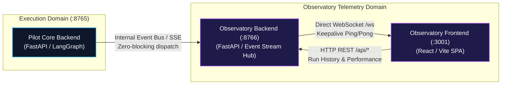
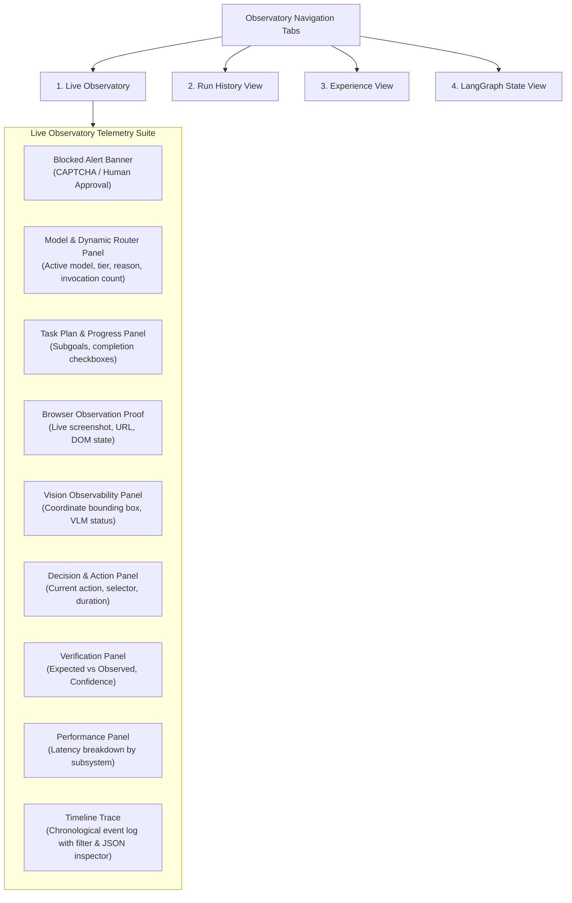

# Pilot Agent Observatory

The **Pilot Agent Observatory** is a standalone, real-time developer dashboard engineered to provide complete visual introspection into the internal decision-making, model routing, DOM interactions, and verification steps of Agentic Pilot.

---

## Architectural Isolation

To ensure that real-time telemetry rendering never degrades agent latency or execution memory, the Observatory runs as an independent application and process on separate ports:



---

## Core Dashboard Views & Components

The Observatory frontend (`observatory/frontend/src/App.tsx`) is structured into four primary functional views:



---

## View Breakdown

### 1. Live Observatory
* **Model & Dynamic Router**: Displays the primary reasoning LLM (`qwen2.5:1.5b`), active vision model (`moondream`), routing policy (`reasoning`, `fast`, `balanced`), and routing rationale (e.g., *"Fallback to configured model_fallback 'qwen2.5:1.5b'"*).
* **Task Plan & Progress**: Shows the high-level goal, step counter, and subtask decomposition.
* **Browser Observation Proof**: Displays the real-time screenshot captured after the most recent navigation or action.
* **Vision Observability**: Displays normalized coordinates (`x_percent`, `y_percent`), pixel calculations, and whether the vision model or DOM selector was utilized.
* **Decision & Action Panel**: Summarizes the current action type, targeted element locator, action execution latency, and prior action history.
* **Verification Panel**: Highlights the hard verification record with color-coded PASS (green) / FAIL (rose) badges, comparing `expected` vs `observed` data dictionaries.
* **Performance Panel**: Live bar charts displaying latency distribution across Planner, Vision, Browser Action, Verification, and Waiting tiers.
* **Timeline Trace**: A searchable, chronological log of all emitted telemetry events (`TASK_STARTED`, `DOM_EXTRACTED`, `ACTION_PLANNED`, `VERIFICATION_RECORDED`).

### 2. Run History View
* Queries SQLite (`pilot.db`) to display historical agent execution sessions.
* Filters by status (`completed`, `failed`, `blocked`), task duration, and timestamp.
* Clicking any historical run loads its full event trace, screenshot proofs, and performance metrics into the Live Observatory interface for replay inspection.

### 3. Experience View
* Interfaces with ChromaDB (`pilot_memories`) and SQLite to display episodic memories accumulated by the agent.
* Inspects successful strategies, failure diagnoses, and domain-specific knowledge tags that the agent re-uses across tasks.

### 4. LangGraph State View
* A developer inspection utility providing a real-time JSON dump of the underlying `AgentState` object.
* Displays raw internal state variables, including `action_manifest`, `retrieved_knowledge`, `approval_id`, and `retry_count`.

---

## Telemetry Event Model

Events dispatched from the core backend implement the `ObservatoryEvent` schema:

```typescript
interface ObservatoryEvent {
  event_id: string;
  run_id: string;
  task_id: string;
  timestamp: string;
  event_type: string;     // e.g. "TASK_STARTED", "ACTION_EXECUTED", "VERIFICATION_RECORDED"
  status: string;         // "running", "completed", "failed", "blocked"
  step_index: number;
  message: string;
  metadata: Record<string, any>;
}
```

---

*Related Pages:*
* [[Evidence & Verification|Evidence-and-Verification]]
* [[Architecture|Architecture]]
* [[Experience & Learning|Experience-and-Learning]]
