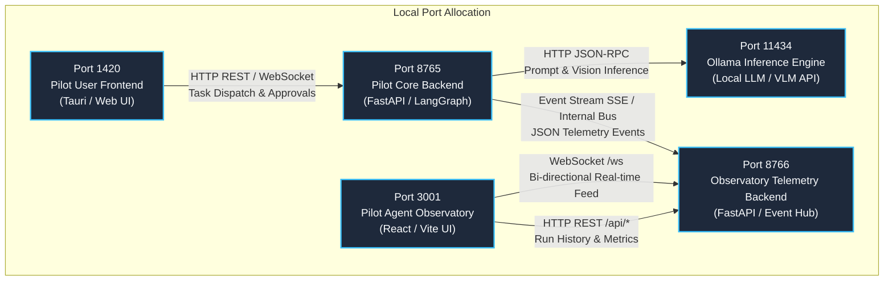
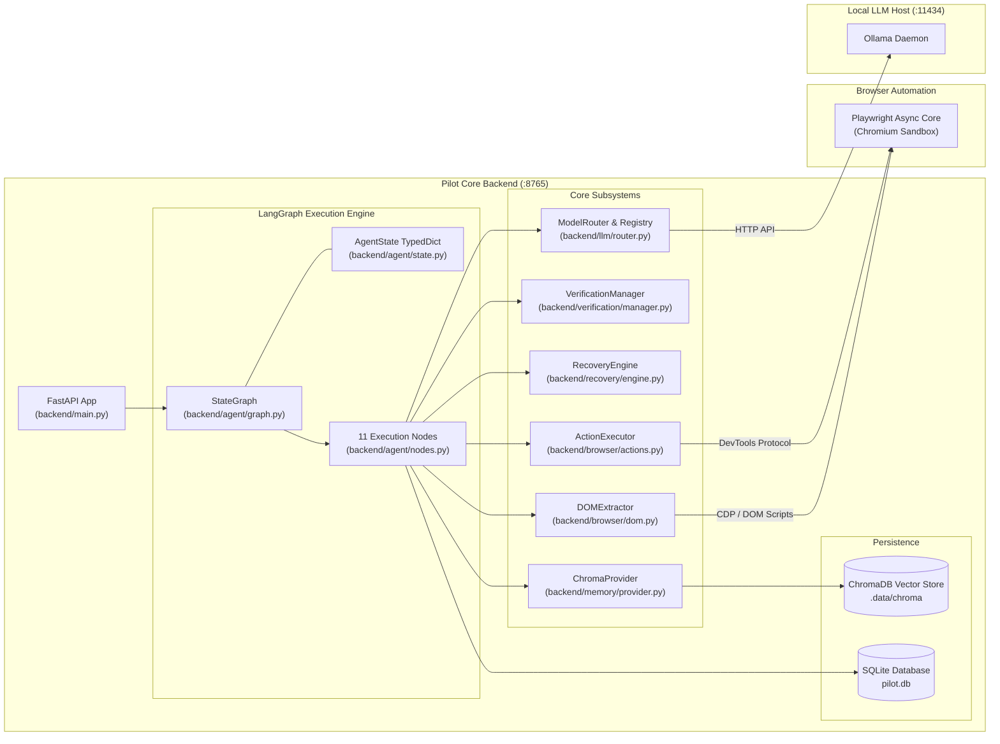
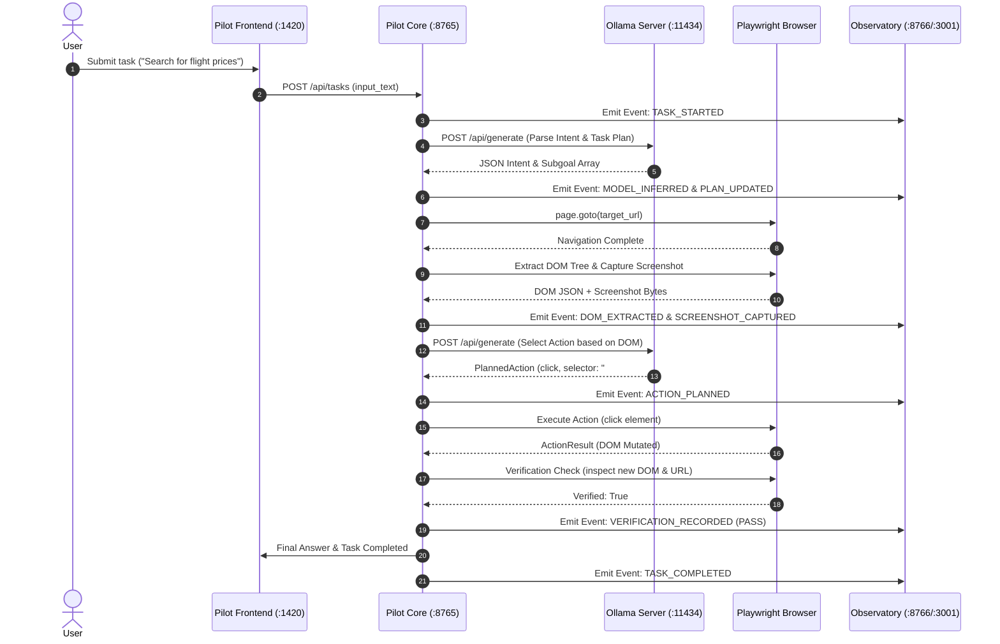

# System Architecture

The architecture of **Agentic Pilot** is designed around strict principles of local data sovereignty, separation of concerns, and resilient closed-loop state transitions. The system operates as a distributed set of decoupled processes communicating over localhost network interfaces.

---

## High-Level Topology & Port Mapping

Agentic Pilot separates operational execution from administrative observation to guarantee that telemetry collection and developer inspection never interfere with real-time agent decision-making.

---

## Detailed Component Architecture

---

## Architectural Layers

### 1. Client & Presentation Layer
* **Pilot User UI (`:1420`)**: User-facing application for entering prompts, monitoring task progress, granting human-in-the-loop approvals, and viewing final outputs.
* **Pilot Agent Observatory (`:3001`)**: Read-only engineering dashboard that consumes real-time telemetry events. Displays model routing decisions, planned subgoals, visual coordinate bounding boxes, verification proofs, and LangGraph state variables.

### 2. Orchestration & Graph Layer (`backend/agent`)
* **LangGraph `StateGraph`**: A compiled cyclic graph defining 11 deterministic states. Unlike linear ReAct chains, LangGraph allows conditional routing, looping back to re-observe the DOM upon failed actions, and structured recovery escalation.
* **`AgentState`**: A strongly-typed Python dictionary (`TypedDict`) containing task inputs, parsed goals, active model, locator trees, action histories, verification records, and recovery flags.
* **Nodes & Routers**: Modular functions executing atomic phases (`parse_intent_node`, `navigate_node`, `plan_action_node`, `execute_action_node`, `verify_node`, `error_recovery_node`).

### 3. Cognition & Routing Layer (`backend/llm`)
* **`ModelRegistry`**: Maintains operational metadata for installed Ollama models (context length, latency tier, priority, capabilities).
* **`CapabilityAnalyzer`**: Parses incoming subtasks to deduce required capabilities (`planning`, `coding`, `vision`, `lightweight`, `recovery`).
* **`ModelRouter`**: Dynamically maps task demands to the best local model while preventing model switching thrashing.

### 4. Perception & Action Layer (`backend/browser` & `backend/vision`)
* **`ActionExecutor`**: Executes actions against the active Playwright `Page` (`click`, `type_text`, `select_option`, `navigate`, `scroll`).
* **`DOMExtractor`**: Parses the webpage into an accessibility-focused interactive tree, pruning invisible elements and assigning numerical element IDs.
* **`VisionFallback`**: Activated when DOM selectors are insufficient or dynamic canvas/iframe elements are present. Uses multimodal VLMs to infer normalized `(x, y)` coordinates.

### 5. Verification & Recovery Layer (`backend/verification` & `backend/recovery`)
* **`VerificationManager`**: Performs post-action deterministic checks (URL navigation status, DOM mutation delta, form input value confirmation).
* **`RecoveryEngine`**: Classifies failures into discrete error types (`captcha`, `transient`, `element_not_found`, `verification_failed`) and enforces a four-tier escalation ladder.

### 6. Persistence & Memory Layer (`backend/db` & `backend/memory`)
* **SQLite (`pilot.db`)**: Stores runs, tasks, action steps, verification events, and operational audits.
* **ChromaDB (`.data/chroma`)**: Vector database powering semantic retrieval of past task strategies, successes, and failure diagnoses.

---

## Data Flow Pipeline

---

*Related Pages:*
* [[Agent Execution Lifecycle|Agent-Execution-Lifecycle]]
* [[Local LLM & Model Routing|Local-LLM-and-Model-Routing]]
* [[Agent Observatory|Agent-Observatory]]
