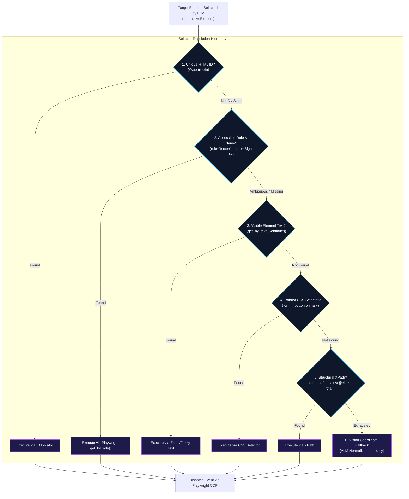
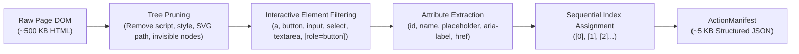

# Browser Automation & DOM Extraction

The browser automation tier in **Agentic Pilot** is powered by an asynchronous **Playwright** runtime. It translates high-level task intents into concrete web interactions using an intelligent DOM extraction pipeline, stealth anti-detection configurations, and a resilient multi-tier locator resolution hierarchy.

---

## The Resilient Locator Resolution Hierarchy

Brittle selectors are the leading cause of automation failure. Agentic Pilot resolves target elements by descending through a prioritized locator ladder before escalating to visual coordinate grounding:

---

## Interactive DOM Extraction Pipeline

Sending full raw HTML documents to local LLMs overflows context windows and degrades reasoning quality. The `DOMExtractor` (`backend/browser/dom.py`) parses the page into an optimized accessibility tree:

### Element Filtering Rules
1. **Visibility Check**: Elements with `display: none`, `visibility: hidden`, or zero bounding boxes (`width == 0` or `height == 0`) are discarded.
2. **Interactive Tags**: Prioritizes `<a>`, `<button>`, `<input>`, `<select>`, `<textarea>`, and elements with `tabindex` or explicit ARIA roles.
3. **Sequential IDs**: Elements receive clean integer identifiers (`[ID 0]`, `[ID 1]`, etc.) allowing local LLMs to choose actions using concise integers rather than complex CSS strings.

---

## Core Browser Actions

The `ActionExecutor` (`backend/browser/actions.py`) handles atomic browser commands with built-in execution timing and state tracking:

| Action | Function Signature | Description & Verification Hooks |
| :--- | :--- | :--- |
| `navigate` | `navigate(page, url)` | Navigates to target URL with `domcontentloaded` wait. Checks for `chrome-error://` pages. |
| `click` | `click(page, element)` | Dispatches mouse click on element. Verifies subsequent DOM mutation. |
| `type_text` | `type_text(page, element, text)` | Types text character-by-character into text inputs, search bars, or textareas. |
| `select_option`| `select_option(page, element, value)` | Selects dropdown options in native HTML `<select>` elements. |
| `scroll` | `scroll(page, direction, amount)` | Scrolls viewport vertically or horizontally to bring elements into view. |

---

## Browser Session Management & Stealth Evasion

The browser pool (`backend/browser/pool.py`) launches Chromium instances configured to prevent automated bot fingerprinting:

* **User-Agent Spoofing**: Configures modern, standard desktop user-agents (e.g., Chrome on Windows/macOS).
* **WebDriver Flag Elimination**: Disables `navigator.webdriver` flags and automation banners.
* **Viewport Normalization**: Enforces standard desktop viewports (1280x800) with proper device scale factors.
* **Headless / Headful Toggling**: Supports both headless operation for background automation and headful display for developer debugging.

---

*Related Pages:*
* [[Vision System|Vision-System]]
* [[Evidence & Verification|Evidence-and-Verification]]
* [[CAPTCHA & Failure Recovery|CAPTCHA-and-Failure-Recovery]]
