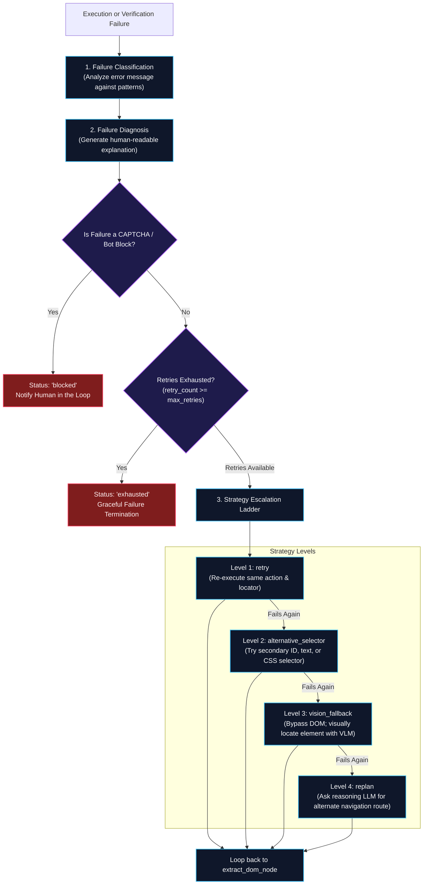
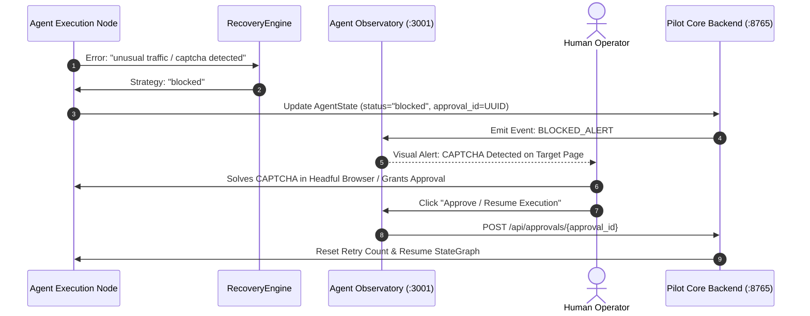

# CAPTCHA & Failure Recovery

Web automation in adversarial environments is subject to anti-bot challenges, transient network drops, dynamic DOM changes, and unexpected modal overlays. **Agentic Pilot** replaces naive retry loops with an intelligent, multi-stage **Recovery Engine** (`backend/recovery/engine.py`).

---

## Strategy Escalation Ladder

When an action or verification check fails, the `RecoveryEngine` routes the agent through a bounded four-tier escalation ladder:



---

## Failure Classification Hierarchy

The `RecoveryEngine` categorizes raw runtime exceptions into discrete failure classes:

| Failure Type | Recognized Signatures | Default Escalation Policy |
| :--- | :--- | :--- |
| `captcha` | `captcha`, `recaptcha`, `sorry/index`, `unusual traffic`, `bot verification`, `i'm not a robot` | **Immediate Halt (`blocked`)**. Do not retry to prevent IP bans. Request human intervention. |
| `transient` | `timeout`, `net::ERR_`, `CONNECTION_REFUSED`, `socket hung up` | Level 1: `retry` with exponential backoff. |
| `element_not_found`| `Element has no usable selector`, `missing element`, `element not found` | Level 2: `alternative_selector` → Level 3: `vision_fallback`. |
| `verification_failed` | `Verification failed`, `Input verification failed`, `URL mismatch` | Level 2: `alternative_selector` → Level 4: `replan`. |
| `navigation_failed` | `DNS lookup failed`, `chrome-error://`, `HTTP 5xx` | Level 1: `retry` → Level 4: `replan`. |
| `vision_needed` | `need_help`, `Cannot find element in DOM tree` | Level 3: `vision_fallback`. |
| `llm_failure` | `Structured LLM response failed`, `not valid JSON` | Level 1: `retry` with increased JSON temperature constraints. |

---

## Human-in-the-Loop Intervention

When a CAPTCHA or anti-bot challenge is detected:



### Safety Guarantees
1. **Zero Bot-Bypassing Hacks**: Agentic Pilot does not attempt brittle or unethical CAPTCHA-cracking services. It pauses cleanly and hands control to the operator.
2. **State Preservation**: The Playwright browser page and LangGraph memory state remain active during the block, allowing seamless resumption once resolved.

---

## Recovery Record Schema

Each recovery event is recorded as a `RecoveryRecord` (`backend/recovery/engine.py`):

```python
class RecoveryRecord(BaseModel):
    failure_type: str                   # Classified category
    diagnosis: str                      # Human-readable explanation
    strategy: str                       # Active escalation strategy
    retry_count: int                    # Current attempt index
    max_retries: int                    # Bounded limit (default: 6)
    outcome: str                        # "retry", "escalated", "exhausted"
    timestamp: str                      # ISO 8601 UTC timestamp
```

---

*Related Pages:*
* [[Vision System|Vision-System]]
* [[Evidence & Verification|Evidence-and-Verification]]
* [[Agent Execution Lifecycle|Agent-Execution-Lifecycle]]
