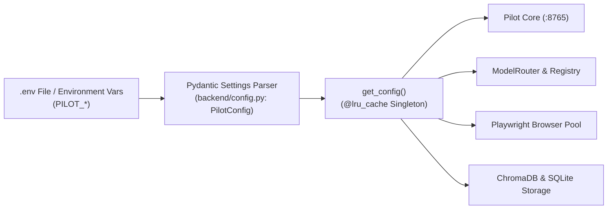

# Configuration Specification

All runtime behavior in **Agentic Pilot** is configurable via environment variables prefixed with `PILOT_`. Settings are parsed, validated, and type-coerced using **Pydantic Settings** (`backend/config.py`).

---

## Configuration Architecture



---

## Environment Variables Reference

### 1. General & Core Server Settings

| Variable | Default Value | Type | Description |
| :--- | :--- | :--- | :--- |
| `PILOT_SERVER_PORT` | `8765` | `int` | Core FastAPI HTTP/WebSocket server listening port. |
| `PILOT_DEBUG_MODE` | `false` | `bool` | Enables verbose debug logging across all subsystems. |
| `PILOT_DATA_DIR` | `~/.pilot/data` | `str` | Root directory for application artifacts and data files. |
| `PILOT_LOG_DIR` | `~/.pilot/logs` | `str` | Directory for rotating system logs and privacy audits. |
| `PILOT_DB_PATH` | `~/.pilot/data.db` | `str` | Path to local SQLite relational database. |
| `PILOT_APP_VERSION` | `1.0.0` | `str` | Framework release version string. |

### 2. Local Ollama & Inference Engine

| Variable | Default Value | Type | Description |
| :--- | :--- | :--- | :--- |
| `PILOT_OLLAMA_BASE_URL` | `http://127.0.0.1:11434` | `str` | HTTP endpoint for the local Ollama inference server. |
| `PILOT_OLLAMA_MODEL` | `qwen2.5:1.5b` | `str` | Default primary text model for intent parsing and planning. |
| `PILOT_OLLAMA_VISION_MODEL`| `moondream` | `str` | Default vision model for visual coordinate grounding. |
| `PILOT_TASK_CONTEXT_TOKEN_BUDGET` | `3500` | `int` | Maximum context tokens reserved for prompts and DOM elements. |
| `PILOT_VISION_CACHE_ENABLED` | `true` | `bool` | Enables SHA-256 screenshot hashing to cache VLM inferences. |
| `PILOT_EMBEDDING_CACHE_ENABLED` | `true` | `bool` | Caches dense vector embeddings for recurring text queries. |

### 3. Multi-Model Routing Configuration

| Variable | Default Value | Type | Description |
| :--- | :--- | :--- | :--- |
| `PILOT_ENABLE_MULTI_MODEL` | `true` | `bool` | Enables dynamic multi-model routing; if `false`, ablates to single model. |
| `PILOT_MODEL_ROUTING_STRATEGY`| `dynamic` | `str` | Routing policy: `dynamic`, `static`, or `single`. |
| `PILOT_MODEL_REASONING` | `qwen2.5:7b` | `str` | Preferred model for complex multi-step reasoning. |
| `PILOT_MODEL_VISION` | `moondream` | `str` | Preferred model for image analysis and coordinate grounding. |
| `PILOT_MODEL_CODING` | `qwen2.5-coder:3b` | `str` | Preferred model for code generation and regex crafting. |
| `PILOT_MODEL_LIGHTWEIGHT` | `deepseek-r1:1.5b` | `str` | Preferred model for high-speed, lightweight subtasks. |
| `PILOT_MODEL_FALLBACK` | `qwen2.5:1.5b` | `str` | Universal failover model when specialized tiers are absent. |
| `PILOT_MODEL_SWITCH_COOLDOWN_STEPS` | `1` | `int` | Number of steps to hold an active model before allowing a switch. |

### 4. Browser Automation & Playwright

| Variable | Default Value | Type | Description |
| :--- | :--- | :--- | :--- |
| `PILOT_HEADLESS_BROWSER` | `false` | `bool` | Runs browser headful (`false`) or headless (`true`). |
| `PILOT_BROWSER_POOL_SIZE` | `3` | `int` | Maximum concurrent browser context pool size. |
| `PILOT_KEEP_BROWSER_OPEN` | `true` | `bool` | Keeps browser instance open across tasks to retain session state. |
| `PILOT_BROWSER_IDLE_TIMEOUT_MINUTES` | `15` | `int` | Inactivity window before closing idle background browser contexts. |
| `PILOT_MAX_RETRY_COUNT` | `3` | `int` | Maximum retries per individual action before strategy escalation. |
| `PILOT_MAX_TASK_DURATION_MINUTES` | `5` | `int` | Hard timeout ceiling for long-running autonomous tasks. |

### 5. Safety, Risk & Human Approvals

| Variable | Default Value | Type | Description |
| :--- | :--- | :--- | :--- |
| `PILOT_AUTO_APPROVE_LOW_RISK`| `true` | `bool` | Automatically executes low-risk navigation and read actions. |
| `PILOT_APPROVAL_TIMEOUT_SECONDS` | `10` | `int` | Timeout waiting for human approval before pausing task. |
| `PILOT_SESSION_TTL_HOURS` | `24` | `int` | Time-to-live for authenticated browser session profiles. |
| `PILOT_PRIVACY_AUDIT_ENABLED`| `true` | `bool` | Logs all outbound data calls to ensure zero cloud leakage. |
| `PILOT_PRIVACY_AUDIT_LOG` | `~/.pilot/logs/privacy_audit.jsonl` | `str` | Destination file for cryptographic privacy audit trails. |

### 6. Research Ablation Flags

For academic research and ablation benchmarking, core subsystems can be independently disabled:

| Feature Flag | Default | System Disabled When False |
| :--- | :--- | :--- |
| `PILOT_ENABLE_EVIDENCE` | `true` | Evidence collection and screenshot proofs. |
| `PILOT_ENABLE_VERIFICATION`| `true` | Hard verification checks; actions assumed successful without DOM assertions. |
| `PILOT_ENABLE_RECOVERY` | `true` | Strategy escalation; failures immediately abort the task. |
| `PILOT_ENABLE_MEMORY` | `true` | Episodic ChromaDB storage; agent starts stateless every run. |
| `PILOT_ENABLE_RAG` | `true` | Knowledge retrieval from external vector collections. |
| `PILOT_EXPERIMENT_MODE` | `false` | When enabled, runs deterministic evaluation batches and dumps metrics. |

---

## Example `.env` Configuration File

```bash
# === Core Server Settings ===
PILOT_SERVER_PORT=8765
PILOT_DEBUG_MODE=true
PILOT_DATA_DIR=~/.pilot/data

# === Local Ollama Host ===
PILOT_OLLAMA_BASE_URL=http://127.0.0.1:11434
PILOT_OLLAMA_MODEL=qwen2.5:1.5b
PILOT_OLLAMA_VISION_MODEL=moondream

# === Multi-Model Routing ===
PILOT_ENABLE_MULTI_MODEL=true
PILOT_MODEL_ROUTING_STRATEGY=dynamic
PILOT_MODEL_REASONING=qwen2.5:7b
PILOT_MODEL_FALLBACK=qwen2.5:1.5b

# === Browser Automation ===
PILOT_HEADLESS_BROWSER=false
PILOT_KEEP_BROWSER_OPEN=true

# === Subsystem Flags ===
PILOT_ENABLE_VERIFICATION=true
PILOT_ENABLE_RECOVERY=true
PILOT_ENABLE_MEMORY=true
```

---

*Related Pages:*
* [[Installation & Setup|Installation-and-Setup]]
* [[Local LLM & Model Routing|Local-LLM-and-Model-Routing]]
* [[Architecture|Architecture]]
