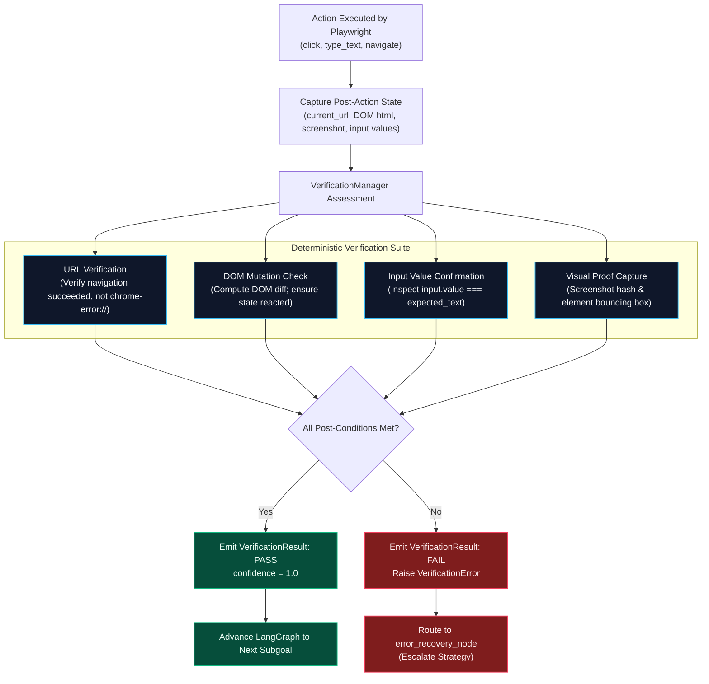

# Evidence & Hard Verification

A foundational defect in standard LLM agent frameworks is "hallucinated completion"—where an agent assumes an action succeeded simply because the LLM generated the tool call. **Agentic Pilot** solves this by enforcing an **Evidence-Driven Hard Verification Framework** (`backend/verification/manager.py`).

---

## Verification Pipeline: Expected → Observed → Proof

Every browser action executed by the agent must pass an independent deterministic post-condition verification check before the task is allowed to proceed or conclude.



---

## The `VerificationResult` Schema

Verification events produce a structured `VerificationResult` record that enables precise ablation benchmarking and auditing:

```python
class VerificationResult(BaseModel):
    verified: bool                      # True if check succeeded, False if failed
    type: str                           # "url", "dom_mutation", "text_typed", "state_assertion"
    expected: dict[str, Any]            # What the action intended to cause
    observed: dict[str, Any]            # What the browser DOM/URL actually reflects
    confidence: float                   # Verification confidence score (0.0 to 1.0)
    message: str                        # Diagnostic explanation
    timestamp: str                      # ISO 8601 UTC timestamp
```

### Example Verification Evidence Payloads

#### 1. Navigation Verification
```json
{
  "verified": true,
  "type": "url",
  "expected": { "requested_url": "https://example.com/login" },
  "observed": { "current_url": "https://example.com/login", "status": 200 },
  "confidence": 1.0,
  "message": "URL successfully reached without browser network error"
}
```

#### 2. Form Input Typing Verification
```json
{
  "verified": true,
  "type": "text_typed",
  "expected": { "target_input": "search-input", "value": "Agentic Pilot" },
  "observed": { "element_value": "Agentic Pilot", "matches": true },
  "confidence": 1.0,
  "message": "Element value strictly matches requested text"
}
```

---

## Core Verification Routines

### 1. Navigation Verification (`verify_url`)
* **Checks**: Confirms the page URL loaded cleanly.
* **Failure Detection**: Flags browser error protocols (`chrome-error://`), DNS lookup failures (`ERR_NAME_NOT_RESOLVED`), and connection timeouts (`ERR_CONNECTION_REFUSED`).

### 2. DOM Mutation Verification (`verify_dom_mutation`)
* **Checks**: Compares the HTML snapshot before and after an interaction.
* **Failure Detection**: Detects dead clicks (clicks on unclickable canvas overlays or dead anchors) where the underlying DOM tree underwent zero modification.

### 3. Exact Text Verification (`extract_exact_text_to_type`)
* **Checks**: Uses regex intent extractors to isolate requested quotes, then inspects the active DOM input element's `.value` property.
* **Failure Detection**: Flags incomplete typing (e.g., typing cut off by keyup listeners or character limit truncations).

### 4. Visual Evidence Collection
* **Checks**: Takes a timestamped screenshot after every major state transition.
* **Storage**: Encoded into the telemetry event stream and saved to disk for post-run visual auditing in the **Agent Observatory**.

---

*Related Pages:*
* [[Browser Automation|Browser-Automation]]
* [[Agent Execution Lifecycle|Agent-Execution-Lifecycle]]
* [[Agent Observatory|Agent-Observatory]]
