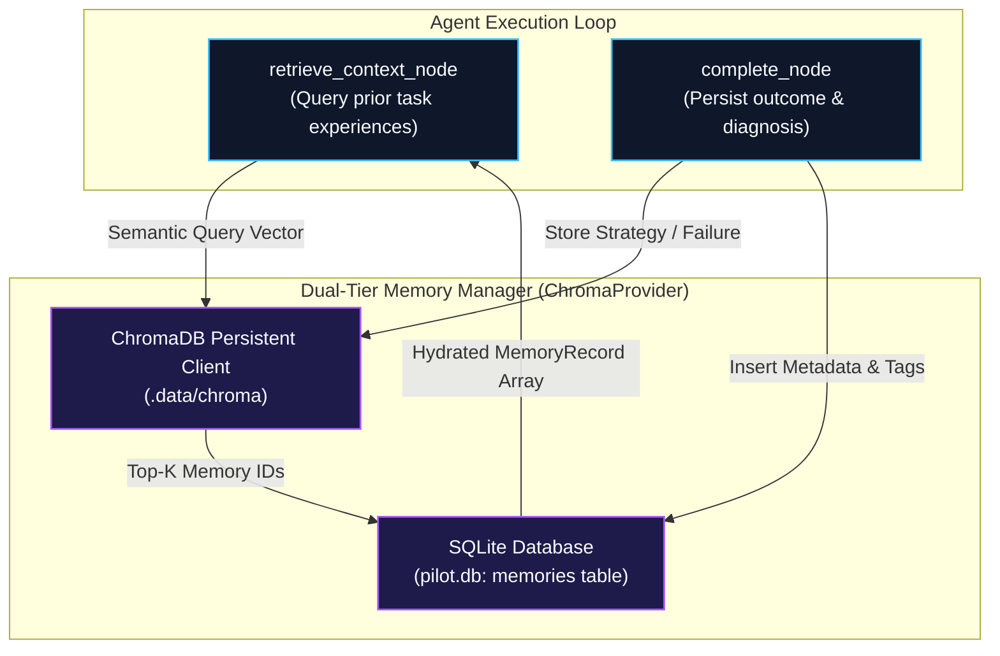
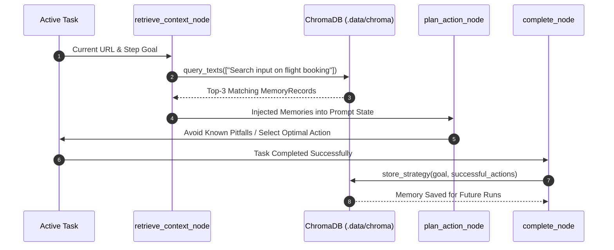

# Experience & Episodic Learning

Agentic Pilot features a dual-tier memory system designed to retain knowledge across autonomous executions. By learning which selectors, workflows, and navigation paths succeed or fail on specific web domains, the agent avoids repeating costly trial-and-error mistakes.

---

## Dual-Tier Memory Architecture

The memory system combines relational metadata tracking in **SQLite** with dense semantic vector indexing in **ChromaDB**:



---

## Memory Record Schema

Every stored memory adheres to the `MemoryRecord` model (`backend/memory/provider.py`):

```python
class MemoryRecord(BaseModel):
    memory_id: str                      # Unique UUID v4
    type: str                           # "semantic", "strategy", "failure", "episodic"
    content: str                        # Natural language distillation of the experience
    task_id: str | None = None          # Associated task session identifier
    tags: list[str] = []                # Domain or technology tags (e.g. ["google.com", "flight_search"])
    created_at: str                     # ISO 8601 UTC timestamp
    last_accessed_at: str               # ISO 8601 UTC timestamp
    access_count: int                   # Frequency of reuse
```

---

## Core Memory Operations

### 1. Context Retrieval (`retrieve_relevant` & `retrieve_strategies`)
* **Trigger**: Invoked automatically during `retrieve_context_node` before action planning.
* **Mechanism**: Generates vector embeddings for the current task prompt and domain, querying the `pilot_memories` collection for the top-$K$ most relevant records.
* **Injection**: Injected into the prompt sent to the local reasoning LLM as structured guidance:
  ```markdown
  ### Retrieved Past Experiences
  - [SUCCESS]: On domain example.com, submit button requires scrolling into view before click.
  - [FAILURE]: Selector '#old-login' fails due to dynamic iframe; use visual fallback instead.
  ```

### 2. Strategy Storage (`store_strategy`)
* **Trigger**: Invoked by `complete_node` when a task successfully accomplishes its goal.
* **Content**: Stores an abstracted summary of the sequence of actions that proved effective.

### 3. Failure Learning (`store_failure`)
* **Trigger**: Invoked by `complete_node` or `error_recovery_node` when an action or verification fails.
* **Content**: Records the failed selector, the error diagnostic, and the recovery strategy that resolved it.

---

## The Experience Lifecycle



---

*Related Pages:*
* [[Agent Execution Lifecycle|Agent-Execution-Lifecycle]]
* [[Agent Observatory|Agent-Observatory]]
* [[CAPTCHA & Failure Recovery|CAPTCHA-and-Failure-Recovery]]
