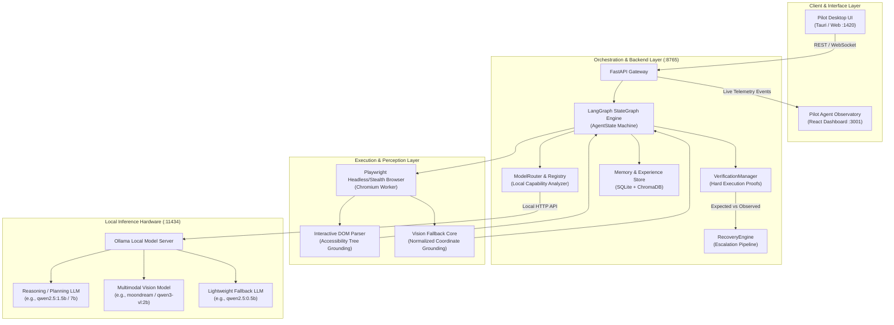

# Agentic Pilot

## An Evidence-Driven, Privacy-Preserving Local Autonomous AI Agent Framework for Intelligent Task Automation

Welcome to the official technical Wiki for **Agentic Pilot**, an open-source, local-first autonomous AI agent designed for resilient web and browser automation. Built on top of **LangGraph**, **Ollama**, and **Playwright**, Agentic Pilot guarantees 100% data privacy by running entirely on local consumer hardware without external cloud API dependencies.

---

### What is Agentic Pilot?

Agentic Pilot bridges the gap between probabilistic neural reasoning and deterministic software execution. While conventional browser automation scripts are brittle to DOM alterations and cloud-based LLM agents leak sensitive enterprise data and credentials, Agentic Pilot introduces a locally hosted, closed-loop state machine with **hard execution verification**, **capability-aware multi-model routing**, and **real-time visual observability**.

---

### Core Engineering Innovations

| Innovation | Technical Implementation | Practical Benefit |
| :--- | :--- | :--- |
| **Local-First Privacy** | Operates against local Ollama runtime (`http://127.0.0.1:11434`); zero cloud egress. | Enterprise compliance; credentials, sessions, and cookies remain exclusively on-device. |
| **LangGraph Closed Loop** | 11-node cyclic state machine with formal transitions and bounded retries. | Eliminates infinite looping, hallucinated completions, and premature exits. |
| **Hard Verification** | `VerificationManager` comparing expected state mutations with observed DOM/URL realities. | Replaces "blind trust" LLM assertions with cryptographically and structural verifiable proof. |
| **Capability-Aware Router** | `ModelRouter` matching task complexity with installed local model capabilities. | Optimal performance trade-off; runs lightweight models for parsing, VLM for image analysis. |
| **Strategy Escalation** | Multi-tier recovery: `retry` → `alternative_selector` → `vision_fallback` → `replan`. | High resilience against dynamic SPAs, DOM tree shuffling, and anti-bot obstacles. |
| **Real-Time Observatory** | Standalone developer dashboard (:3001) streaming events via WebSocket (:8766). | Full introspection into model decisions, coordinate bounding boxes, and LangGraph states. |

---

### Quick Navigation & Wiki Structure

Explore the dedicated technical sections of the Agentic Pilot documentation:

#### 1. Core Architecture & Execution
* **[[Architecture|Architecture]]**: Complete structural decomposition of backend, frontend, database, and telemetry services.
* **[[Agent Execution Lifecycle|Agent-Execution-Lifecycle]]**: Exhaustive state-machine node transitions (`parse_intent` to `complete`).
* **[[Local LLM & Model Routing|Local-LLM-and-Model-Routing]]**: Capability analyzer, model registry, anti-thrashing, and single-model fallback policies.

#### 2. Perception & Action
* **[[Vision System|Vision-System]]**: Multimodal coordinate grounding, relative coordinate normalization (`0.0`–`1.0`), and screenshot caching.
* **[[Browser Automation|Browser-Automation]]**: Playwright async management, stealth headers, viewport isolation, and resilient locator hierarchies.
* **[[Evidence & Verification|Evidence-and-Verification]]**: Verification rules, confidence thresholds, URL assertions, and DOM mutation diffing.

#### 3. Reliability & Telemetry
* **[[Agent Observatory|Agent-Observatory]]**: Telemetry architecture, event streaming, run history, and the 4 dashboard panels.
* **[[Experience & Learning|Experience-and-Learning]]**: Dual-tier storage (SQLite + ChromaDB vector embeddings), strategy reuse, and failure memory.
* **[[CAPTCHA & Failure Recovery|CAPTCHA-and-Failure-Recovery]]**: Failure classification, diagnosis generation, and human-in-the-loop intervention.

#### 4. Developer Reference & Operations
* **[[Configuration|Configuration]]**: Comprehensive `.env` and Pydantic configuration parameters.
* **[[Installation & Setup|Installation-and-Setup]]**: Windows, Linux, and macOS step-by-step setup guides.
* **[[API Reference|API-Reference]]**: Complete REST and WebSocket contract definitions for both core and observatory ports.
* **[[Development Guide|Development-Guide]]**: Guide to writing custom graph nodes, plugins, and test harnesses.
* **[[Testing & Evaluation|Testing-and-Evaluation]]**: Pytest suite execution, test coverage, and benchmark methodology.
* **[[Troubleshooting|Troubleshooting]]**: Known edge cases, socket disconnects, and resolution playbooks.
* **[[Roadmap|Roadmap]]**: Current implementation boundaries vs. planned research extensions.

---

*Continue to [[Architecture|Architecture]] to inspect the underlying system design.*
