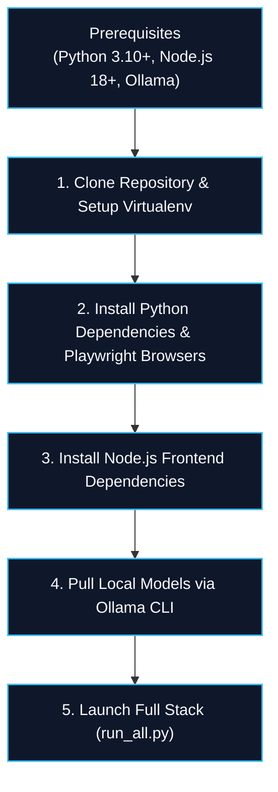

# Installation & Setup

This guide provides step-by-step instructions for installing and running **Agentic Pilot** on **Windows**, **Linux**, and **macOS**. Because the entire stack operates locally, no external cloud API keys (such as OpenAI or Anthropic) are required.

---

## Installation Pipeline Overview



---

## 1. System Prerequisites

Before installation, verify that the following dependencies are installed and available in your system path:

* **Python**: `3.10` or higher (`python --version`)
* **Node.js**: `18.0.0` or higher (`node --version`)
* **Package Managers**: `pip` and `npm`
* **Local LLM Engine**: [Ollama](https://ollama.com/) installed and running
* **Hardware**:
  * Minimum: 8 GB RAM, 4-core CPU, 4 GB VRAM (runs `qwen2.5:0.5b` and `moondream`).
  * Recommended: 16+ GB RAM, 8+ GB VRAM GPU (NVIDIA RTX or Apple Silicon) for `qwen2.5:7b`.

---

## 2. Clone Repository & Create Virtual Environment

```bash
# Clone the repository
git clone https://github.com/sudeshsudhii/Agentic-pilot-local.git
cd Agentic-pilot-local

# Create Python virtual environment
python -m venv .venv

# Activate virtual environment
# Windows (PowerShell):
.venv\Scripts\Activate.ps1
# Windows (Command Prompt):
.venv\Scripts\activate.bat
# Linux / macOS (bash/zsh):
source .venv/bin/activate
```

---

## 3. Install Python Dependencies & Playwright

```bash
# Upgrade pip
python -m pip install --upgrade pip

# Install backend dependencies
pip install -r backend/requirements.txt

# Install Playwright browser binaries (Chromium)
playwright install chromium
```

---

## 4. Install Frontend UI Dependencies

Agentic Pilot includes two frontend applications: the primary User Application (:1420) and the developer Observatory (:3001).

```bash
# Install Pilot User UI dependencies
cd frontend
npm install
cd ..

# Install Observatory UI dependencies
cd observatory/frontend
npm install
cd ../..
```

---

## 5. Download Local Models via Ollama

Ensure Ollama is running (`ollama serve`), then pull the recommended local models:

```bash
# 1. Primary Reasoning & Intent Decomposition Model
ollama pull qwen2.5:1.5b

# 2. Multimodal Vision Model (for visual coordinate grounding)
ollama pull moondream:latest

# Optional: Higher-capacity reasoning model (if 8+ GB VRAM available)
ollama pull qwen2.5:7b
```

Verify model availability:
```bash
ollama list
```

---

## 6. Launching the Application

### Option A: Unified Launcher (Recommended)

The easiest way to launch all background microservices and frontends simultaneously is using the built-in orchestrator:

```bash
python run_all.py
```

This launches:
1. **Ollama Service** (`http://127.0.0.1:11434`)
2. **Pilot Core Backend** (`http://127.0.0.1:8765`)
3. **Observatory Backend** (`http://127.0.0.1:8766`)
4. **Pilot User Frontend** (`http://127.0.0.1:1420`)
5. **Pilot Agent Observatory** (`http://127.0.0.1:3001`)

### Option B: Manual Service Startup

To run individual components in separate terminal windows:

```bash
# Terminal 1: Start Ollama Daemon
ollama serve

# Terminal 2: Start Pilot Core Backend (:8765)
python -m backend.main

# Terminal 3: Start Observatory Telemetry Backend (:8766)
python -m observatory.backend.main

# Terminal 4: Start Observatory Frontend Dashboard (:3001)
cd observatory/frontend
npm run dev

# Terminal 5: Start Pilot User Frontend (:1420)
cd frontend
npm run dev
```

---

## 7. Verification of Successful Startup

1. Open **Pilot User UI**: Navigate to `http://127.0.0.1:1420/`.
2. Open **Agent Observatory**: Navigate to `http://127.0.0.1:3001/`. Confirm both `PILOT BACKEND: CONNECTED` and `EVENT STREAM: CONNECTED` indicators are green.
3. Submit a test instruction in the UI:
   ```text
   Search for "Python async best practices" on duckduckgo.com
   ```

---

*Related Pages:*
* [[Configuration|Configuration]]
* [[Architecture|Architecture]]
* [[Troubleshooting|Troubleshooting]]
