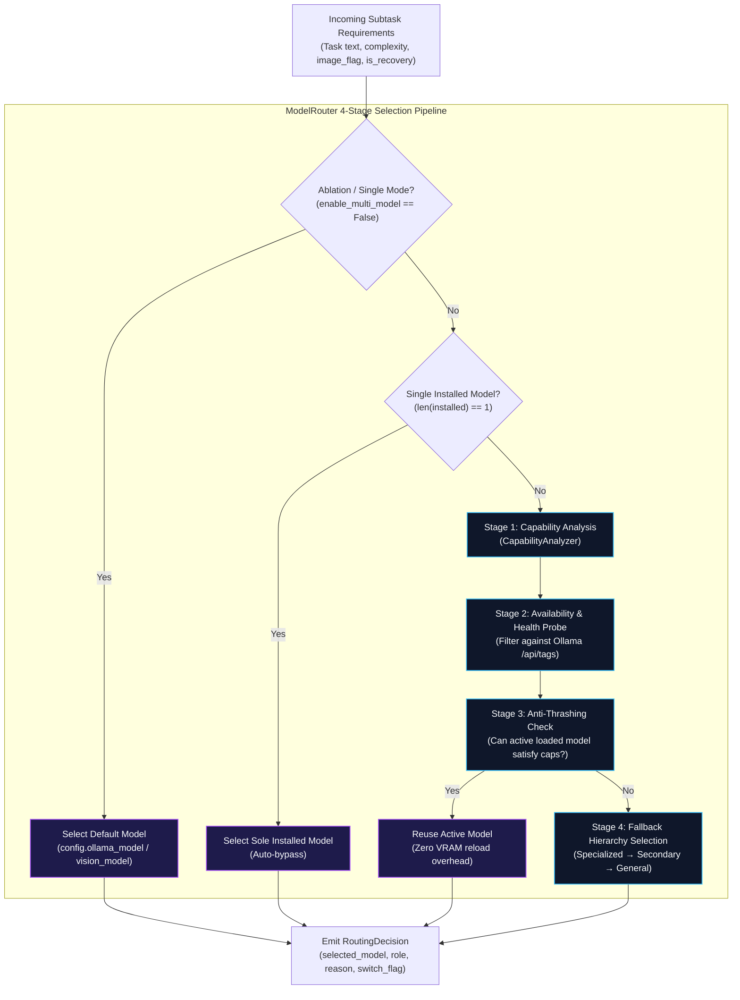
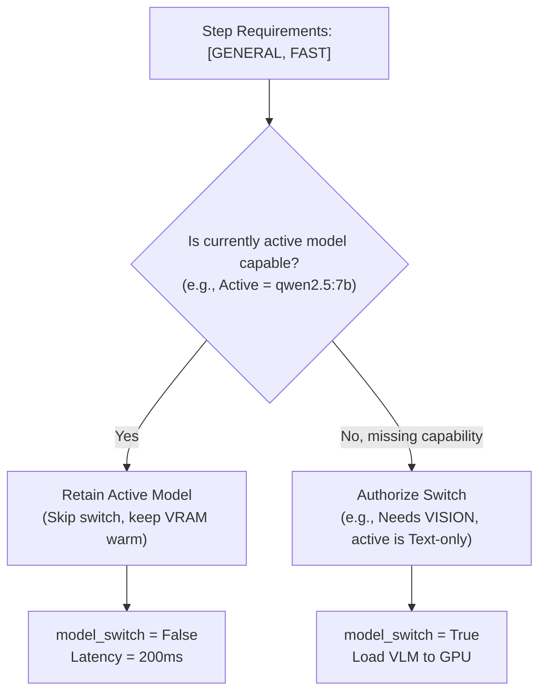

# Local LLM & Model Routing

Agentic Pilot operates strictly against local language and multimodal models hosted via **Ollama** (`http://127.0.0.1:11434`). To maximize task success rates while fitting inside consumer GPU memory budgets (e.g., 6 GB to 16 GB VRAM), the framework incorporates an intelligent, capability-aware **Model Router**.

---

## The 4-Stage Routing Pipeline

The `ModelRouter` (`backend/llm/router.py`) dynamically selects the most capable local model for each discrete graph step while preventing unnecessary GPU VRAM thrashing.



---

## Model Capabilities & Roles

The system decouples generic model names from operational capabilities via `ModelCapability` and `ModelRole` enums (`backend/llm/registry.py`):

### Model Capabilities (`ModelCapability`)
* `REASONING`: Complex multi-step reasoning and logical deductions.
* `PLANNING`: Intent decomposition and goal sequencing.
* `GENERAL`: Broad task instruction following and text synthesis.
* `VISION`: Multimodal understanding of screenshot images.
* `GUI_UNDERSTANDING`: Visual identification of buttons, forms, and icons.
* `CODING`: Generation of structured regex, CSS selectors, or JavaScript snippets.
* `DEBUGGING`: Diagnosing failed actions or browser error logs.
* `LIGHTWEIGHT`: Ultra-fast inference with small memory footprints (< 2B parameters).
* `FAST`: Low latency response (< 500ms).
* `RECOVERY`: Specialized failure diagnosis and recovery replanning.
* `TOOL_CALLING`: Strict compliance with JSON function and tool schemas.

### Pre-Configured Model Profiles

The `ModelRegistry` maintains verified profiles for standard local Ollama models:

| Model Identifier | Parameter Size | Primary Capabilities | Latency Tier | Default Role |
| :--- | :--- | :--- | :--- | :--- |
| `qwen2.5:7b` | 7B | `reasoning`, `planning`, `general`, `tool_calling`, `recovery` | Medium | Primary Planner |
| `qwen2.5:1.5b` | 1.5B | `planning`, `general`, `lightweight`, `fast`, `tool_calling` | Low | General / Planner |
| `qwen2.5:0.5b` | 0.5B | `lightweight`, `fast`, `general` | Ultra-Low | Lightweight Parser |
| `moondream:latest` | ~1.6B | `vision`, `gui_understanding`, `fast` | Low | Multimodal Grounding |
| `qwen3-vl:2b` | 2B | `vision`, `gui_understanding`, `reasoning` | Medium | Primary Vision Model |
| `qwen2.5-vl:7b` | 7B | `vision`, `gui_understanding`, `reasoning`, `planning` | High | Advanced Vision Model |

---

## Anti-Thrashing Architecture

When running local models via Ollama, swapping a 7B model for a 1.5B model forces the Ollama runtime to unload the existing model weights from GPU VRAM and load new tensors from NVMe storage, introducing a 2 to 5 second cold-start penalty.

The `ModelRouter` mitigates this with an **Anti-Thrashing Filter** (`Stage 3`):



If the currently active model possesses all necessary capabilities for the upcoming step, the router reuses it even if a smaller model would theoretically suffice. A model switch is only triggered when:
1. The active model lacks a required capability (e.g., an image must be processed, but the active model is text-only).
2. An unrecoverable timeout occurred on the active model, triggering recovery escalation.
3. The user explicitly sets `model_routing_strategy="cost_latency"`.

---

## Structured Output & Gateway Enforcement

Local models frequently deviate from strict JSON schema constraints. The `OllamaGateway` (`backend/llm/gateway.py`) acts as a resilient validation proxy:

1. **System Prompt Injection**: Enforces strict JSON grammar schemas in system prompts.
2. **Schema Validation**: Parses returned responses into Pydantic models (`ParsedIntent`, `PlannedAction`, `TaskPlan`).
3. **Markdown Fence Stripping**: Automatically strips leading/trailing markdown code blocks (````json ... ````) before deserialization.
4. **Fallback Parsing**: If JSON decoding fails, invokes regex extractors to rescue action parameters before escalating to an error recovery node.

---

*Related Pages:*
* [[Vision System|Vision-System]]
* [[Agent Execution Lifecycle|Agent-Execution-Lifecycle]]
* [[Configuration|Configuration]]
