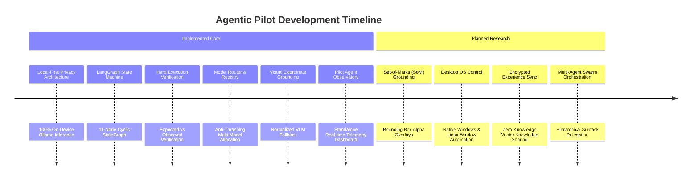

# Project Roadmap

This document outlines the demarcation between **currently implemented & verified functionality** and **planned architectural evolutions** for Agentic Pilot.

---

## Architectural Timeline & Milestones

---

## Currently Implemented Capabilities

The following features are **fully implemented, tested, and verifiable** in the current repository:

* [x] **Local Privacy Boundary**: 100% local inference via Ollama (`:11434`); zero cloud API dependencies.
* [x] **LangGraph StateGraph**: 11-node cyclic state machine with bounded retries and formal edge routing.
* [x] **Multi-Model Router**: 4-stage capability-aware model routing (`ModelRouter`, `ModelRegistry`, `CapabilityAnalyzer`) with anti-thrashing GPU VRAM reuse.
* [x] **Browser Automation Core**: Playwright async management with stealth headers and resilient locator hierarchy (ID → Accessible Role → Text → CSS → XPath).
* [x] **Interactive DOM Pruning**: Accessibility-tree extractor with assigned integer element IDs for efficient local LLM prompting.
* [x] **Multimodal Visual Fallback**: Normalized relative coordinate grounding (`0.0`–`1.0`) with SHA-256 screenshot inference caching.
* [x] **Hard Execution Verification**: Deterministic post-action checks (`VerificationManager`) producing structured `VerificationResult` proofs.
* [x] **Strategy Escalation Engine**: Multi-tier failure escalation (`retry` → `alternative_selector` → `vision_fallback` → `replan`).
* [x] **Ethical CAPTCHA Handling**: Immediate pause on bot challenges with human-in-the-loop approval workflows.
* [x] **Dual-Tier Memory System**: Relational execution logs in SQLite (`pilot.db`) and semantic vector experience storage in ChromaDB (`.data/chroma`).
* [x] **Pilot Agent Observatory**: Dedicated real-time telemetry dashboard (:3001) streaming events via WebSocket (:8766).
* [x] **Ablation Feature Flags**: Academic research switches (`enable_verification`, `enable_recovery`, `enable_memory`, etc.) for comparative benchmarking.

---

## Planned Research & Future Evolutions

The following capabilities represent active research directions and planned architectural extensions:

### 1. Set-of-Marks (SoM) Visual Prompting
* **Objective**: Automatically overlay numbered visual tags directly onto webpage screenshots before VLM inference.
* **Benefit**: Dramatically enhances visual coordinate grounding accuracy for small icons and canvas-rendered buttons without requiring raw coordinate regression.

### 2. Native Desktop OS Automation
* **Objective**: Extend automation beyond the browser viewport to native desktop operating system windows (Windows, macOS, Linux).
* **Approach**: Implement desktop accessibility API connectors (UIAutomation on Windows, AT-SPI on Linux) coordinated through the same LangGraph state machine.

### 3. Encrypted P2P Experience Synchronization
* **Objective**: Allow teams to share learned successful strategies and failure diagnoses across isolated agent nodes.
* **Approach**: Zero-knowledge vector encryption ensuring that synchronized experiences contain zero sensitive customer credentials or cookies.

### 4. Distributed Multi-Agent Swarms
* **Objective**: Allow a primary planner agent to spawn independent child browser workers to execute parallel research subtasks simultaneously.

---

## Contributing & Proposing RFCs

We welcome community feedback, feature proposals, and research collaborations.
* To propose architectural changes, open a GitHub Discussion or submit an RFC pull request.
* See the [[Development Guide|Development-Guide]] for coding standards and test requirements.

---

*Related Pages:*
* [[Home|Home]]
* [[Architecture|Architecture]]
* [[Development Guide|Development-Guide]]
