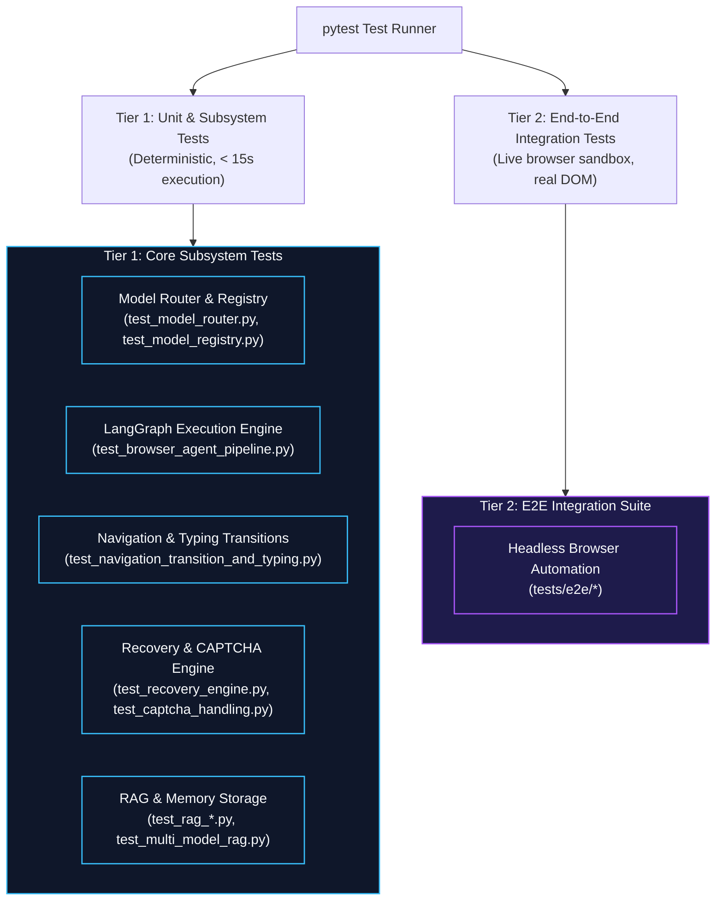

# Testing & Evaluation

**Agentic Pilot** maintains a comprehensive automated testing suite encompassing unit tests, state machine validation, mock-based inference pipelines, and end-to-end browser execution tests.

---

## Testing Architecture

The test suite is structured into two tiers: fast deterministic tests (using mocked Ollama gateways and Playwright stubs) and end-to-end integration tests.



---

## Running the Automated Test Suite

Ensure the virtual environment is activated before running tests:

### 1. Run Complete Test Suite
```bash
pytest tests/ -v
```

### 2. Run Specific Subsystem Test Suites
```bash
# Model Router & Multi-Model Allocation
pytest tests/test_model_router.py tests/test_model_registry.py -v

# Navigation, Observation & Text Typing Pipeline
pytest tests/test_navigation_transition_and_typing.py -v

# Recovery Engine & CAPTCHA Handling
pytest tests/test_recovery_engine.py tests/test_captcha_handling.py -v

# Memory & Vector Retrieval (ChromaDB)
pytest tests/test_rag_retrieval.py tests/test_multi_model_rag.py -v
```

### 3. Generate Code Coverage Report
```bash
pytest tests/ --cov=backend --cov-report=term-missing
```

---

## Mocking Strategy & Determinism

To allow fast, offline continuous integration (CI) without requiring GPU hardware or live Ollama servers:

* **Ollama Mocking**: The `OllamaGateway` is mocked in unit tests to return pre-computed, deterministic JSON responses adhering to the `ParsedIntent`, `PlannedAction`, and `TaskPlan` schemas.
* **Playwright Async Mocking**: Browser network responses and DOM HTML states are simulated using synthetic HTML fixtures to verify selector resolution and failure escalations.
* **Database Isolation**: Unit tests utilize in-memory SQLite instances (`sqlite:///:memory:`) and temporary ChromaDB directories to prevent persistent test pollution.

---

## Benchmark & Evaluation Metrics

For research evaluations and paper replications, Agentic Pilot tracks the following metrics during test execution:

1. **Task Completion Rate (TCR)**: Percentage of tasks where all subgoals pass hard verification without human intervention.
2. **Verification Accuracy**: Precision and recall of `VerificationManager` comparing observed DOM realities against expected actions.
3. **Escalation Resolution Rate (ERR)**: Frequency with which `RecoveryEngine` recovers from failed actions via alternative selectors or vision fallback.
4. **Subsystem Latency Budget**: Mean duration spent across Planner, Vision, Browser CDP, and Verification phases.

---

*Related Pages:*
* [[Development Guide|Development-Guide]]
* [[Agent Execution Lifecycle|Agent-Execution-Lifecycle]]
* [[Evidence & Verification|Evidence-and-Verification]]
