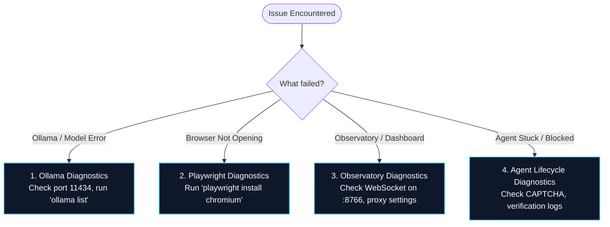

# Troubleshooting Guide

This guide documents verified diagnosis steps and resolutions for common issues encountered during setup, development, and execution.

---

## Quick Diagnostic Flowchart



---

## 1. Local Ollama & Inference Issues

### Symptom: `Cannot connect to host 127.0.0.1:11434`
* **Root Cause**: The Ollama background daemon is either stopped or blocked by firewall rules.
* **Resolution**:
  1. Open a terminal and run:
     ```bash
     ollama serve
     ```
  2. Verify connectivity by querying the API:
     ```bash
     curl http://127.0.0.1:11434/api/tags
     ```

### Symptom: `model 'qwen2.5:1.5b' not found`
* **Root Cause**: The requested model has not been downloaded into the local Ollama repository.
* **Resolution**:
  Download the required models:
  ```bash
  ollama pull qwen2.5:1.5b
  ollama pull moondream:latest
  ```

---

## 2. Playwright & Browser Issues

### Symptom: `Executable doesn't exist at C:\Users\...\AppData\Local\ms-playwright\chromium...`
* **Root Cause**: Playwright Python library is installed, but the underlying Chromium browser binaries have not been downloaded.
* **Resolution**:
  Run the Playwright installer command in your activated virtual environment:
  ```bash
  playwright install chromium
  ```

### Symptom: Agent navigates to page but gets stuck waiting indefinitely
* **Root Cause**: Modern Single Page Applications (SPAs) with live WebSockets or long-polling often never fire the browser `networkidle` event.
* **Resolution**:
  Agentic Pilot defaults to `domcontentloaded` wait policy (`backend/browser/actions.py`). Ensure custom scripts do not force `networkidle` timeouts.

---

## 3. Observatory & Dashboard Issues

### Symptom: Dashboard appears to shake, text flickers, or socket drops every 2–3 seconds
* **Root Cause**: Node.js/Vite dev-server WebSocket proxy dropping idle sockets with `ECONNABORTED`.
* **Resolution**:
  * Ensure the frontend connects directly to the FastAPI backend port: `ws://127.0.0.1:8766/ws` instead of going through the Vite dev proxy.
  * Keep-alive ping/pong is enabled by default in [`App.tsx`](file:///e:/Case%20Study/Case%20Study%20SRM/pilot/observatory/frontend/src/App.tsx).

### Symptom: Black or blank screen on Observatory (`:3001`)
* **Root Cause**: Unhandled React exception during telemetry deserialization.
* **Resolution**:
  An `ErrorBoundary` is included in `App.tsx` that catches unexpected payload types. Click **Reset Dashboard** to clear corrupted memory states, or check browser developer console (`F12`).

---

## 4. Agent Execution & Recovery Issues

### Symptom: Agent pauses with status `blocked`
* **Root Cause**: Anti-bot challenge (Google CAPTCHA, Cloudflare Turnstile) detected on the destination webpage.
* **Resolution**:
  1. Agentic Pilot does not run brittle bot-breaking bypasses to protect account safety.
  2. The browser page remains open. Solve the challenge manually in the headful browser window.
  3. In the Observatory or User UI, click **Approve / Resume** (or dispatch `POST /api/approvals/{approval_id}`) to resume execution.

---

*Related Pages:*
* [[Installation & Setup|Installation-and-Setup]]
* [[Agent Observatory|Agent-Observatory]]
* [[CAPTCHA & Failure Recovery|CAPTCHA-and-Failure-Recovery]]
