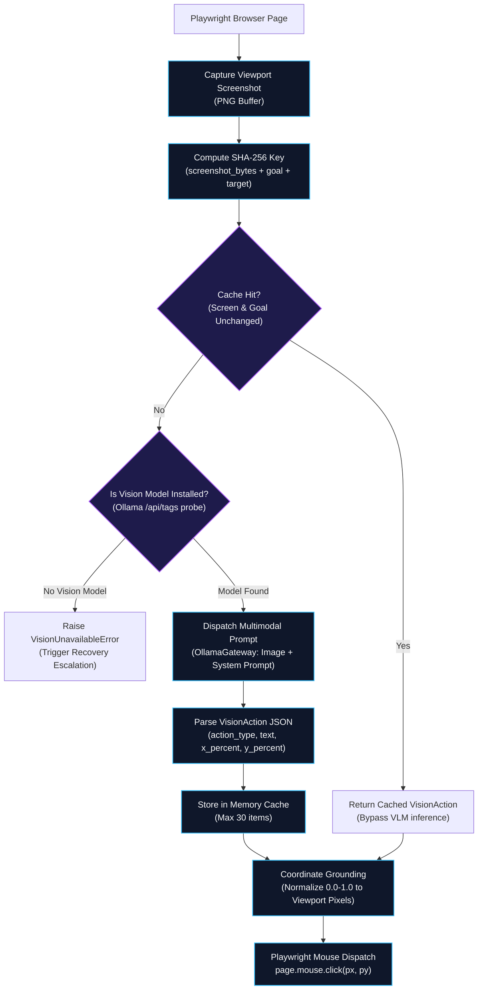
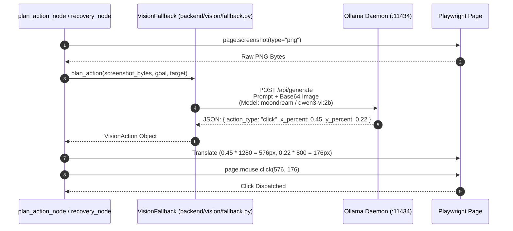

# Vision System & Visual Coordinate Grounding

While standard web automation frameworks rely exclusively on the DOM tree, modern web applications frequently embed dynamic canvas elements, SVG charts, obfuscated class names, or deeply nested shadow DOM trees. The **Vision System** in Agentic Pilot provides visual fallback capabilities using local Vision-Language Models (VLMs) hosted in Ollama.

---

## Multimodal Perception Pipeline

The vision system operates as a hybrid grounding engine, activating when DOM extraction is insufficient or when the recovery engine escalates to `vision_fallback`.

---

## Visual Coordinate Grounding

Rather than requiring the local VLM to output absolute pixel coordinates (which vary by display scaling, DPI, and window size), Agentic Pilot standardizes on **Normalized Relative Coordinates**:

* `x_percent`: Float value between `0.0` (left edge) and `1.0` (right edge).
* `y_percent`: Float value between `0.0` (top edge) and `1.0` (bottom edge).
* Exact Center: `x = 0.5, y = 0.5`.

### Translation to Playwright Viewport Pixels

When a `VisionAction` is returned, the executor translates relative coordinates into physical pixels using the current Playwright page viewport dimensions:

$$\text{Pixel}_X = \lfloor x_{\text{percent}} \times \text{Viewport Width} \rfloor$$
$$\text{Pixel}_Y = \lfloor y_{\text{percent}} \times \text{Viewport Height} \rfloor$$

---

## Screenshot Hashing & Inference Caching

Local VLM inference on consumer hardware can take between 800ms and 3,500ms depending on parameter size. To avoid redundant compute cycles during multi-step tasks where the screen has not changed:

1. **Hash Generation**: `VisionFallback` computes a SHA-256 hash combining:
   * Raw image byte buffer.
   * Active step goal string.
   * Target element description string.
2. **Cache Eviction**: A lightweight LRU cache (default: 30 entries) retains recent inferences.
3. **Short-Circuit**: If the agent re-evaluates the page without visual changes, the previous `VisionAction` is reused instantly, reducing latency to < 1ms.

---

## Supported Local Vision Models

The framework prioritizes compact, high-efficiency vision models suited for local execution:

1. **`moondream:latest` (~1.6B)**:
   * Recommended for entry-level GPUs (4 GB to 8 GB VRAM).
   * Fast coordinate localization, low memory overhead.
2. **`qwen3-vl:2b` (2B)**:
   * Balanced vision model with strong OCR and UI element detection.
3. **`qwen2.5-vl:7b` (7B)**:
   * High-accuracy grounding for complex dashboards and low-contrast interfaces.

If visual analysis is invoked but no vision-capable model is discovered in Ollama, the system raises a `VisionUnavailableError` and safely redirects the execution flow to the `RecoveryEngine` without crashing.

---

*Related Pages:*
* [[Local LLM & Model Routing|Local-LLM-and-Model-Routing]]
* [[Browser Automation|Browser-Automation]]
* [[CAPTCHA & Failure Recovery|CAPTCHA-and-Failure-Recovery]]
